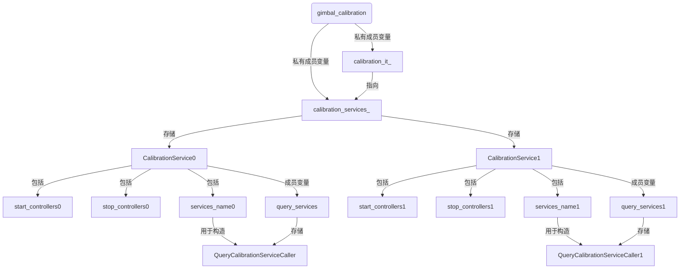

## 代码结构

1. 文件中有两个类CalibrationService、CalibrationQueue，前者在后者中被实例化
2. CalibrationQueue中有多个CalibrationService，一般一个CalibrationService对应的就是一个关节的校准，他们可以都被放进一个队列中
2. 结构图如下（按照步兵配置文件中的gimbal_calibration举例）

```yaml
  gimbal_calibration:
  
  	（CalibrationService0）
    - start_controllers:
        - controllers/gimbal_calibration_controller
      stop_controllers:
        - controllers/gimbal_controller
      services_name:
        - /controllers/gimbal_calibration_controller/is_calibrated
  
	（CalibrationService1）
  - start_controllers:
        - controllers/cover_calibration_controller
      stop_controllers:
        - controllers/cover_controller
      services_name:
        - /controllers/cover_calibration_controller/is_calibrated
```





## 代码详解

```c++
class CalibrationService
{
public:
  CalibrationService(XmlRpc::XmlRpcValue& rpc_value, ros::NodeHandle& nh)
  {
    //...（省略获取参数部分）
    for (int i = 0; i < rpc_value["services_name"].size(); ++i)
    {
      //用配置文件中获取的services_name构造QueryCalibrationServiceCaller，并放置到query_services中
      query_services.push_back(new QueryCalibrationServiceCaller(nh, rpc_value["services_name"][i]));
    }
  }
  void setCalibratedFalse()
  {
    for (auto& service : query_services)
      service->getService().response.is_calibrated = false;
  }
  bool isCalibrated()	//用于获取是否校准成功
  {
    bool is_calibrated = true;
    for (auto& service : query_services)
      is_calibrated &= service->isCalibrated();	//service->isCalibrated()这个接口会得到校准是否成功，如果query_services中所有的服务都返回true，那么说明所有校准都成功，此时才返回true
    return is_calibrated;
  }
  void callService()
  {
    for (auto& service : query_services)
      service->callService();	//具体看QueryCalibrationServiceCaller这个类
  }
  std::vector<std::string> start_controllers, stop_controllers;
  std::vector<QueryCalibrationServiceCaller*> query_services;
  bool flip_controller_ = false;

private:
  static std::vector<std::string> getControllersName(XmlRpc::XmlRpcValue& rpc_value)
  {
    std::vector<std::string> controllers;
    for (int i = 0; i < rpc_value.size(); ++i)
    {
      controllers.push_back(rpc_value[i]);
    }
    return controllers;
  }
};
```

```c++
class CalibrationQueue
{
public:
  explicit CalibrationQueue(XmlRpc::XmlRpcValue& rpc_value, ros::NodeHandle& nh, ControllerManager& controller_manager)
    : controller_manager_(controller_manager), switched_(false)
  {
    // Don't calibration if using simulation
    ros::NodeHandle nh_global;
    bool use_sim_time;
    nh_global.param("use_sim_time", use_sim_time, false);
    if (use_sim_time || rpc_value.getType() != XmlRpc::XmlRpcValue::TypeArray)
      return;
    for (int i = 0; i < rpc_value.size(); ++i)
      calibration_services_.emplace_back(rpc_value[i], nh);
    last_query_ = ros::Time::now();
    calibration_itr_ = calibration_services_.end();
    // Start with calibrated, you should use reset() to start calibration.
  }
    
  void reset()	//每次调用reset，calibration_itr_会指向calibration_services_中的第一个
  {
    if (calibration_services_.empty())
      return;
    calibration_itr_ = calibration_services_.begin();
    switched_ = false;
      
 //调用calibration_services_中的每一个service的setCalibratedFalse()，此时就会认为还没有校准，后面在update中就会通过那一系列的判断，最后进行校准
    for (auto service : calibration_services_)	
      service.setCalibratedFalse();
  }
    
  void update(const ros::Time& time)
  {
    if (calibration_services_.empty())
      return;
    if (isCalibrated())
      return;
    if (switched_)
    {
      if (calibration_itr_->isCalibrated())
      {
        if (calibration_itr_->flip_controller_)
          controller_manager_.startControllers(calibration_itr_->stop_controllers);
        controller_manager_.stopControllers(calibration_itr_->start_controllers);
        calibration_itr_++;
        switched_ = false;
      }
      else if ((time - last_query_).toSec() > .2)
      {
        last_query_ = time;
        calibration_itr_->callService();
      }
    }
    else
    {
      // Switch controllers
      switched_ = true;
      if (calibration_itr_ != calibration_services_.end())
      {
        controller_manager_.startControllers(calibration_itr_->start_controllers);
        controller_manager_.stopControllers(calibration_itr_->stop_controllers);
      }
    }
  }
    
  bool isCalibrated()
  {
    return calibration_itr_ == calibration_services_.end();
  }
    
  void stopController()
  {
    if (calibration_services_.empty())
      return;
    if (calibration_itr_ != calibration_services_.end() && switched_)
      controller_manager_.stopControllers(calibration_itr_->stop_controllers);
  }
    
  void stop()
  {
    if (switched_)
    {
      calibration_itr_ = calibration_services_.end();
      switched_ = false;
    }
  }
    
 ....
}
```

