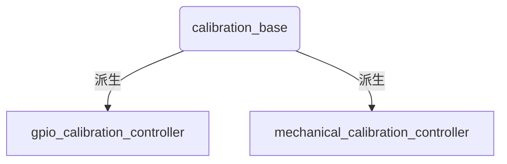

## 原理

1. 一个概念 ---> 转子位置offset：从电机原始数据中解包并计算得到一个位置后，我们会加上一个offset，得到最终的转子位置，校准控制器就是在设置这个offset，通过设置offset将某一个位置设为零点

2. 通过以下两句理解校准

   ```c++
   /*1*/
   act_data.pos =
               act_coeff.act2pos * static_cast<double>(act_data.q_raw + 8191 * act_data.q_circle) + act_data.offset;
   
   /*2*/
   actuator_.setOffset(-actuator_.getPosition() + actuator_.getOffset());
   ```

   - 当电机在某一固定位置停下后，此时可知其转子的位置，由第一句计算可以得到
   - 第二句改变的其实是第一句中的act_data.offset，当act_data.offset变为-actuator_.getPosition() + actuator_.getOffset()后，那么计算一下就可以知道，此时act_data.pos算出来将会是0（）。即校准后，这个固定位置就变成了位置为0的点（零点），实现校准。


## 代码结构



1. 基类中是校准控制器通用的部分代码
2. 控制器的运行逻辑都在子类的update函数中实现，所以只详解update函数

## 代码详解

### 1. calibration_base

```c++
//
// Created by guanlin on 23-3-14.
//

#include "rm_calibration_controllers/calibration_base.h"

namespace rm_calibration_controllers
{
//实例化两个模板类，每个模板类不同之处在使用的接口不同，根据子类所需接口，需要实例化出不同的模板类
template class CalibrationBase<rm_control::ActuatorExtraInterface, hardware_interface::EffortJointInterface>;
template class CalibrationBase<rm_control::ActuatorExtraInterface, rm_control::GpioStateInterface,
                               hardware_interface::EffortJointInterface>;

template <typename... T>
bool CalibrationBase<T...>::init(hardware_interface::RobotHW* robot_hw, ros::NodeHandle& root_nh,
                                 ros::NodeHandle& controller_nh)
{
  ros::NodeHandle vel_nh(controller_nh, "velocity");
  velocity_ctrl_.init(robot_hw->get<hardware_interface::EffortJointInterface>(), vel_nh);
  XmlRpc::XmlRpcValue actuator;
  if (!controller_nh.getParam("actuator", actuator))
  {
    ROS_ERROR("No actuator given (namespace: %s)", controller_nh.getNamespace().c_str());
    return false;
  }
  actuator_ = robot_hw->get<rm_control::ActuatorExtraInterface>()->getHandle(actuator[0]);
  if (!vel_nh.getParam("search_velocity", velocity_search_))
  {
    ROS_ERROR("Search velocity was not specified (namespace: %s)", controller_nh.getNamespace().c_str());
    return false;
  }
  // advertise service to check calibration
  is_calibrated_srv_ = controller_nh.advertiseService("is_calibrated", &CalibrationBase<T...>::isCalibrated, this);
  return true;
}

template <typename... T>
void CalibrationBase<T...>::starting(const ros::Time& time)
{
  actuator_.setCalibrated(false);	//电机是否校准的标志位，开始校准时需要将其设置为false
  state_ = INITIALIZED;	//每种校准控制器都从INITIALIZED状态开始运行，因为每种校准控制器的第一种模式都相同
  if (actuator_.getCalibrated())
    ROS_INFO("Joint %s will be recalibrated, but was already calibrated at offset %f",
             velocity_ctrl_.getJointName().c_str(), actuator_.getOffset());
}

template <typename... T>
void CalibrationBase<T...>::stopping(const ros::Time& time)
{
  //控制器被stop时，会将下面这个标志位设置为false，这个标志位是用来判断校准是否成功的，用于避免一个bug，具体看添加这个函数的pr的描述
  calibration_success_ = false;
}

//一个服务的回调，用来给校准队列获取校准是否成功的信息
template <typename... T>
bool CalibrationBase<T...>::isCalibrated(control_msgs::QueryCalibrationState::Request& req,
                                         control_msgs::QueryCalibrationState::Response& resp)
{
  ROS_DEBUG("Is calibrated service %d", calibration_success_);
  resp.is_calibrated = calibration_success_;
  return true;
}
}  // namespace rm_calibration_controllers

```


## 2. gpio_calibration_controller

```c++
//运行的具体表现在README中有写，可以参考

void GpioCalibrationController::update(const ros::Time& time, const ros::Duration& period)
{
  switch (state_)
  {
    case INITIALIZED:	//控制器start时会进入该模式，只让电机按照一个期望速度转动
    {
      velocity_ctrl_.setCommand(velocity_search_);	//设置一个速度期望，期望从配置文件获取
      state_ = FAST_FORWARD;	//进入快速转动模式
      break;
    }
    case FAST_FORWARD:
    {
      if (gpio_state_handle_.getValue() != initial_gpio_state_)
      {
          //initial_gpio_state_在配置文件中设置，为未检测到时io的状态，当检测到时，会进入该判断
        start_retreat_position_ = velocity_ctrl_.joint_.getPosition();	//设置开始回转的位置，即当前位置
        velocity_ctrl_.setCommand(0);	//速度期望给0，停转，准备回转
        state_ = RETREAT;
      }
      else
        velocity_ctrl_.update(time, period);	//未检测到时继续转动，直到检测到
      break;
    }
    case RETREAT:
    {
      position_ctrl_.setCommand(start_retreat_position_ - backward_angle_);	//设置回转后的位置
      position_ctrl_.update(time, period);	//让期望位置生效，setcommand后必须update，这个期望才会生效
      if (std::abs(position_ctrl_.command_struct_.position_ - position_ctrl_.joint_.getPosition()) < position_threshold_)
        state_ = SLOW_FORWARD;	//当距离期望位置足够近时，慢速转动
      break;
    }
    case SLOW_FORWARD:
    {
      velocity_ctrl_.setCommand(slow_forward_velocity_);	//设置慢速转动时的期望速度
      if (gpio_state_handle_.getValue() != initial_gpio_state_)	//说明检测到了
      {
        velocity_ctrl_.setCommand(0);	//停转
        actuator_.setOffset(-actuator_.getPosition() + actuator_.getOffset());	//当前位置设置为零点
        actuator_.setCalibrated(true);	//标志为设为true
        ROS_INFO("Joint %s calibrated", velocity_ctrl_.getJointName().c_str());
        state_ = CALIBRATED;	//进入最后一个状态，这里只把calibration_success_这个标志位设为true
      }
      velocity_ctrl_.update(time, period);
      break;
    }
    case CALIBRATED:
      calibration_success_ = true;
  }
}
}  // namespace rm_calibration_controllers
```


## 3. mechanical_calibration_controller

```c++
void MechanicalCalibrationController::update(const ros::Time& time, const ros::Duration& period)
{
  switch (state_)
  {
    case INITIALIZED:	//同上
    {
      velocity_ctrl_.setCommand(velocity_search_);
      countdown_ = 100;
      state_ = MOVING_POSITIVE;
      break;
    }
    case MOVING_POSITIVE:
    {
      if (std::abs(velocity_ctrl_.joint_.getVelocity()) < velocity_threshold_ && !actuator_.getHalted())
        countdown_--;	//这里需要一个倒计时，否则电机可能无法转动
      else
        countdown_ = 100;
      if (countdown_ < 0)
      {
        velocity_ctrl_.setCommand(0);	//到达机械限位后停转
        if (!is_center_)	//不需要零点居中
        {
          //下面4行同上
          actuator_.setOffset(-actuator_.getPosition() + actuator_.getOffset());
          actuator_.setCalibrated(true);
          ROS_INFO("Joint %s calibrated", velocity_ctrl_.getJointName().c_str());
          state_ = CALIBRATED;
          
          //可以直接设置一个期望位置，校准完成后，将移动到这个期望位置  
          if (is_return_)
          {
            position_ctrl_.setCommand(target_position_);
          }
          else
          {
            velocity_ctrl_.joint_.setCommand(0.);
            calibration_success_ = true;
          }
        }
        else	//需要零点居中
        {
          positive_position_ = actuator_.getPosition();	//记录下当前位置，即正向限位位置
          countdown_ = 100;
          velocity_ctrl_.setCommand(-velocity_search_);	//向反方向转动
          state_ = MOVING_NEGATIVE;
        }
      }
      velocity_ctrl_.update(time, period);
      break;
    }
    case MOVING_NEGATIVE:
    {
      //基本跟上面一样，只有setOffset不一样
      if (std::abs(velocity_ctrl_.joint_.getVelocity()) < velocity_threshold_)
        countdown_--;
      else
        countdown_ = 100;
      if (countdown_ < 0)
      {
        velocity_ctrl_.setCommand(0);
        negative_position_ = actuator_.getPosition();
        
        //将中点设置为零点
        actuator_.setOffset(-(positive_position_ + negative_position_) / 2 + actuator_.getOffset());
        actuator_.setCalibrated(true);
        ROS_INFO("Joint %s calibrated", velocity_ctrl_.getJointName().c_str());
        state_ = CALIBRATED;
        if (is_return_)
          position_ctrl_.setCommand(target_position_);
        else
        {
          velocity_ctrl_.joint_.setCommand(0.);
          calibration_success_ = true;
        }
      }
      velocity_ctrl_.update(time, period);
      break;
    }
    case CALIBRATED:
    {
      if (is_return_)	//需要移动到指定位置，则距离目标位置小于一个阈值时，calibration_success_设为true
      {
        if ((std::abs(position_ctrl_.joint_.getPosition() - target_position_)) < position_threshold_)
          calibration_success_ = true;
        position_ctrl_.update(time, period);
      }
      else
        velocity_ctrl_.update(time, period);
      break;
    }
  }
}
}  // namespace rm_calibration_controllers

```

