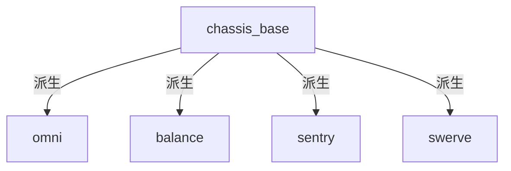

1. [代码结构](##1. 代码结构)

2. [代码详解](##2. 代码详解)

   - [chassis_base](###1. chassis_base)
     - [init()](####1. init())
     - [update()](####2. update())
       - [updateOdom(time, period)](#####<font color=red>updateOdom(time, period)</font>)
       - [powerLimit()](#####<font color=red>powerLimit()</font>)
     - [状态机中的模式](####3. 状态机中的模式)
   - [omni](###2. omni)
   - [balance](###3. balance)
   - [sentry](###4. sentry)
   - [swerve](###5. swerve)

   

---

- **before_reading**：
  1. 运行过程

     - rm_hw会中存在一个主循环，在主循环中会一直调用控制器中重写的update()函数
     - 在update()函数中，会根据state的不同，执行不同的函数，从而实现不同模式的功能

  2. 控制器模式概述

     - raw（0）模式：
       - 速度指令转换到指定坐标系

     - follow（1） 跟随模式：
       - 如果没有设置跟随的坐标系or命令他跟随的坐标系，都将跟随的坐标系设置为yaw（follow跟随的一般都是yaw）
       - 流程：
         - 获取yaw到base_link的四元数转换关系，并转换为一组欧拉角
         - 获取yaw角到0角的最小的角度差（follow_error），这个结果通常在-pi到pi
         - 通过follow_error得到pid指令
         - 从这个pid指令得到底盘速度指令（vel_cmd_z）

     - gyro（2）小陀螺：
       - 把vel_cmd从yaw坐标系转换到base_link坐标系（开gazebo向cmd_vel发速度指令，会发现这个速度指令是yaw坐标系上的）
       - 给一个cmd_vel.z（自转角速度）就能小陀螺

     - twist（3）扭腰模式
       - follow_error的计算公式，导致follow_error拧转一样的变化，再导致vel_cmd.z呈现拧转的变化，最终重现出拧转

---


## 1. 代码结构




## 2. 代码详解

### 1. chassis_base

#### 1. init()

1. 这个函数会在加载时被调用一次，实现初始化；函数返回值为bool，ture则初始化成功，反之失败；函数中有注释，不再详解

#### 2. update()

1. update会被循环调用

   ```c++
   void ChassisBase<T...>::update(const ros::Time& time, const ros::Duration& period)
   {
     //获取对底盘的command以及速度指令cmd_vel
     rm_msgs::ChassisCmd cmd_chassis = cmd_rt_buffer_.readFromRT()->cmd_chassis_;
     geometry_msgs::Twist cmd_vel = cmd_rt_buffer_.readFromRT()->cmd_vel_;
   
     //如果超时没有收到新的指令，则将速度指令置零
     if ((time - cmd_rt_buffer_.readFromRT()->stamp_).toSec() > timeout_)
     {
       vel_cmd_.x = 0.;
       vel_cmd_.y = 0.;
       vel_cmd_.z = 0.;
     }
     else
     {
       //用指令中的加速度来设置斜坡滤波的斜率
       ramp_x_->setAcc(cmd_chassis.accel.linear.x);
       ramp_y_->setAcc(cmd_chassis.accel.linear.y);
       
       //将速度指令输入滤波器
       ramp_x_->input(cmd_vel.linear.x);
       ramp_y_->input(cmd_vel.linear.y);
         
       //xy方向上的速度指令经过斜坡滤波后输出，作为最终得到的底盘在xy上的速度指令
       //经过滤波输出，速度指令会从阶跃的变成有斜率的
       vel_cmd_.x = ramp_x_->output();
       vel_cmd_.y = ramp_y_->output();
         
   
       vel_cmd_.z = cmd_vel.angular.z;
     }
   
     //可以指定follow的坐标系，用于follow模式，默认为yaw
     if (cmd_rt_buffer_.readFromRT()->cmd_chassis_.follow_source_frame.empty())
       follow_source_frame_ = "yaw";
     else
       follow_source_frame_ = cmd_rt_buffer_.readFromRT()->cmd_chassis_.follow_source_frame;
       
     //指定速度指令所在的坐标系，同样默认为yaw
     if (cmd_rt_buffer_.readFromRT()->cmd_chassis_.command_source_frame.empty())
       command_source_frame_ = "yaw";
     else
       command_source_frame_ = cmd_rt_buffer_.readFromRT()->cmd_chassis_.command_source_frame;
   
     if (state_ != cmd_chassis.mode)
     {
       state_ = cmd_chassis.mode;
       state_changed_ = true;
     }
   
     updateOdom(time, period);	//更新odom2base
   
     switch (state_)
     {
       case RAW:
         raw();
         break;
       case FOLLOW:
         follow(time, period);
         break;
       case TWIST:
         twist(time, period);
         break;
     }
   
     ramp_w_->setAcc(cmd_chassis.accel.angular.z);
     ramp_w_->input(vel_cmd_.z);
     vel_cmd_.z = ramp_w_->output();
   
     moveJoint(time, period);	//解算出每个轮子的指令，并setCommand，这个函数在子类中重写
     powerLimit();	//进行功率限制
   }
   ```

   - ##### <font color=red>updateOdom(time, period)</font>

     ```c++
     void ChassisBase<T...>::updateOdom(const ros::Time& time, const ros::Duration& period)
     {
       geometry_msgs::Twist vel_base = odometry();  // on base_link frame
       if (enable_odom_tf_)
       {
         geometry_msgs::Vector3 linear_vel_odom, angular_vel_odom;
         try
         {
           odom2base_ = robot_state_handle_.lookupTransform("odom", "base_link", ros::Time(0));
         }
         catch (tf2::TransformException& ex)
         {
           tf_broadcaster_.sendTransform(odom2base_);  // TODO: For some reason, the sendTransform in init sometime not work?
           ROS_WARN("%s", ex.what());
           return;
         }
         odom2base_.header.stamp = time;
         // integral vel to pos and angle
         tf2::doTransform(vel_base.linear, linear_vel_odom, odom2base_);
         tf2::doTransform(vel_base.angular, angular_vel_odom, odom2base_);
           
         //对速度矢量进行矢量叠加，满足判断条件才更新odom2base，防止nan导致tf异常
         double length =
             std::sqrt(std::pow(linear_vel_odom.x, 2) + std::pow(linear_vel_odom.y, 2) + std::pow(linear_vel_odom.z, 2));
         if (length < max_odom_vel_)
         {
           // avoid nan vel
           odom2base_.transform.translation.x += linear_vel_odom.x * period.toSec();
           odom2base_.transform.translation.y += linear_vel_odom.y * period.toSec();
           odom2base_.transform.translation.z += linear_vel_odom.z * period.toSec();
         }
         length =
             std::sqrt(std::pow(angular_vel_odom.x, 2) + std::pow(angular_vel_odom.y, 2) + std::pow(angular_vel_odom.z, 2));
         if (length > 0.001)
         {  // avoid nan quat
           tf2::Quaternion odom2base_quat, trans_quat;
           tf2::fromMsg(odom2base_.transform.rotation, odom2base_quat);
           trans_quat.setRotation(tf2::Vector3(angular_vel_odom.x / length, angular_vel_odom.y / length,
                                               angular_vel_odom.z / length),
                                  length * period.toSec());
           odom2base_quat = trans_quat * odom2base_quat;
           odom2base_quat.normalize();
           odom2base_.transform.rotation = tf2::toMsg(odom2base_quat);
         }
       }
     
       //
       if (topic_update_)
       {
         auto* odom_msg = odom_buffer_.readFromRT();
     
         tf2::Transform world2sensor;
         world2sensor.setOrigin(
             tf2::Vector3(odom_msg->pose.pose.position.x, odom_msg->pose.pose.position.y, odom_msg->pose.pose.position.z));
         world2sensor.setRotation(tf2::Quaternion(odom_msg->pose.pose.orientation.x, odom_msg->pose.pose.orientation.y,
                                                  odom_msg->pose.pose.orientation.z, odom_msg->pose.pose.orientation.w));
     
         if (world2odom_.getRotation() == tf2::Quaternion::getIdentity())  // First received
         {
           tf2::Transform odom2sensor;
           try
           {
             geometry_msgs::TransformStamped tf_msg =
                 robot_state_handle_.lookupTransform("odom", "livox_frame", odom_msg->header.stamp);
             tf2::fromMsg(tf_msg.transform, odom2sensor);
           }
           catch (tf2::TransformException& ex)
           {
             ROS_WARN("%s", ex.what());
             return;
           }
           world2odom_ = world2sensor * odom2sensor.inverse();
         }
         tf2::Transform base2sensor;
         try
         {
           geometry_msgs::TransformStamped tf_msg =
               robot_state_handle_.lookupTransform("base_link", "livox_frame", odom_msg->header.stamp);
           tf2::fromMsg(tf_msg.transform, base2sensor);
         }
         catch (tf2::TransformException& ex)
         {
           ROS_WARN("%s", ex.what());
           return;
         }
         tf2::Transform odom2base = world2odom_.inverse() * world2sensor * base2sensor.inverse();
         odom2base_.transform.translation.x = odom2base.getOrigin().x();
         odom2base_.transform.translation.y = odom2base.getOrigin().y();
         odom2base_.transform.translation.z = odom2base.getOrigin().z();
         topic_update_ = false;
       }
     
       robot_state_handle_.setTransform(odom2base_, "rm_chassis_controllers");
     
       //发布在odom下的速度
       if (publish_rate_ > 0.0 && last_publish_time_ + ros::Duration(1.0 / publish_rate_) < time)
       {
         if (odom_pub_->trylock())
         {
           odom_pub_->msg_.header.stamp = time;
           odom_pub_->msg_.twist.twist.linear.x = vel_base.linear.x;
           odom_pub_->msg_.twist.twist.linear.y = vel_base.linear.y;
           odom_pub_->msg_.twist.twist.angular.z = vel_base.angular.z;
           odom_pub_->unlockAndPublish();
         }
         if (enable_odom_tf_ && publish_odom_tf_)
           tf_broadcaster_.sendTransform(odom2base_);
         last_publish_time_ = time;
       }
     }
     ```

   - ##### <font color=red>powerLimit()</font>

     - 这一部分是对底盘功率限制理论的代码实现，具体理论查看队内文档
     
     - ```c++
       if (joint.getName().find("wheel") != std::string::npos)  // The pivot joint of swerve drive doesn't need power limit
           {
             a += square(cmd_effort);
             b += std::abs(cmd_effort * real_vel);
             c += square(real_vel);
           }
       
       //npos可以表示string的结束位子，是string::type_size 类型的，也就是find（）返回的类型。find函数在找不到指定值得情况下会返回string::npos。上面代码就是当找到了一个joint叫”wheel“时，执行判断。
       ```

   #### 3. 状态机中的模式

   - raw()

     ```c++
     void ChassisBase<T...>::raw()
     {
       if (state_changed_)
       {
         state_changed_ = false;
         ROS_INFO("[Chassis] Enter RAW");
     
         recovery();	//重置滤波器
       }
         
       //将速度指令转换到base_link坐标系下，内部只有一个tf转换，不再做注释
       //由于cmd_vel这个话题是没有frame_id的，他只有速度值；因此，我们只需要设定好command_source_frame_，向cmd_vel发送我们期望的在command_source_frame_下的速度值，那么tfVelToBase()这个接口就能把速度指令再转换到base_link中，再去做逆解
       tfVelToBase(command_source_frame_);	
     }
     ```

     - ```c++
       void ChassisBase<T...>::recovery()
       {
         ramp_x_->clear(vel_cmd_.x);
         ramp_y_->clear(vel_cmd_.y);
         ramp_w_->clear(vel_cmd_.z);
       }
       ```

   - follow()

     ```c++
     void ChassisBase<T...>::follow(const ros::Time& time, const ros::Duration& period)
     {
       if (state_changed_)
       {
         state_changed_ = false;
         ROS_INFO("[Chassis] Enter FOLLOW");
     
         recovery();	//重置滤波器
         pid_follow_.reset();  //重置pid_follow这个pid控制器
       }
     
       tfVelToBase(command_source_frame_);
       try
       {
         //获取base_link与follow_source_frame_之间的yaw轴角度差
         double roll{}, pitch{}, yaw{};
         quatToRPY(robot_state_handle_.lookupTransform("base_link", follow_source_frame_, ros::Time(0)).transform.rotation,
                   roll, pitch, yaw);
         double follow_error = angles::shortest_angular_distance(yaw, 0);
           
         //进行一个pid计算得到一个cmd，将这个cmd作为z轴角速度的速度期望
         pid_follow_.computeCommand(-follow_error, period);
         vel_cmd_.z = pid_follow_.getCurrentCmd();
       }
       catch (tf2::TransformException& ex)
       {
         ROS_WARN("%s", ex.what());
       }
     }
     ```

   - twist()

     - twist模式现在已经不再使用，就不再写注释了，可以自行了解


## 2. omni

## 3. balance

## 4. sentry

## 5. swerve

