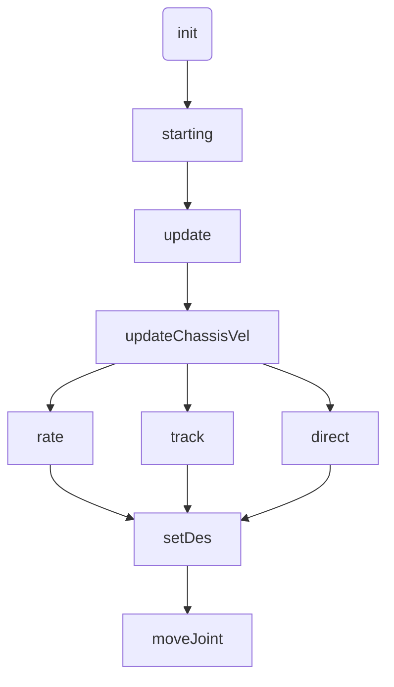

1. [运行流程](##1. 运行流程)

1. [代码详解](##2. 代码详解)

   - [gimbal_base.h](###1. gimbal_base.h)
   - [gimbal_base.cpp](###2. gimbal_base.cpp)
     - [update()](####1. update())
       - [updateChassisVel()](#####updateChassisVel())
     - [状态机中的模式](####2. 状态机中的模式)
       - [rate](#####1. rate)
       - [track](#####2. track)
       - [direct](#####3. direct)
     - [setDes()](####3. setDes())
       - [setDesIntoLimit](#####setDesIntoLimit)
     - [moveJoint](####4. moveJoint())
       - [feedForward()](#####feedForward())
   - [bullet_solver.cpp](###3. bullet_solver.cpp)
   
   ---

- **before_reading**：
  - rate：按照指定速度转动
  - track：自瞄
  - direct：给一个点，瞄到那个点


## 1. 运行流程




## 2. 代码详解

### 1. gimbal_base.h

1. class ChassisVel：作用主要是将差分得到的原始速度值丢进均值滤波器中，进行滤波

1. ```c++
   class ChassisVel	
   {
   public:
     ChassisVel(const ros::NodeHandle& nh)
     {
       //构造两个三维均值滤波器
       double num_data;
       nh.param("num_data", num_data, 20.0);
       nh.param("debug", is_debug_, true);
       linear_ = std::make_shared<Vector3WithFilter<double>>(num_data);
       angular_ = std::make_shared<Vector3WithFilter<double>>(num_data);
       if (is_debug_)
       {
         real_pub_.reset(new realtime_tools::RealtimePublisher<geometry_msgs::Twist>(nh, "real", 1));
         filtered_pub_.reset(new realtime_tools::RealtimePublisher<geometry_msgs::Twist>(nh, "filtered", 1));
       }
     }
     std::shared_ptr<Vector3WithFilter<double>> linear_;
     std::shared_ptr<Vector3WithFilter<double>> angular_;
       
     //调用update会更新chassis_val
     void update(double linear_vel[3], double angular_vel[3], double period)
     {
       if (period < 0)
         return;
       if (period > 0.1)
       {
         linear_->clear();
         angular_->clear();
       }
       
       //将原始的速度数据输入到滤波器中，使用时只需要调用接口就可以获得滤波后的速度
       linear_->input(linear_vel);
       angular_->input(angular_vel);
         
       //下面是将速度发布除去，用于debug
       if (is_debug_ && loop_count_ % 10 == 0)
       {
         if (real_pub_->trylock())
         {
           real_pub_->msg_.linear.x = linear_vel[0];
           real_pub_->msg_.linear.y = linear_vel[1];
           real_pub_->msg_.linear.z = linear_vel[2];
           real_pub_->msg_.angular.x = angular_vel[0];
           real_pub_->msg_.angular.y = angular_vel[1];
           real_pub_->msg_.angular.z = angular_vel[2];
   
           real_pub_->unlockAndPublish();
         }
         if (filtered_pub_->trylock())
         {
           filtered_pub_->msg_.linear.x = linear_->x();
           filtered_pub_->msg_.linear.y = linear_->y();
           filtered_pub_->msg_.linear.z = linear_->z();
           filtered_pub_->msg_.angular.x = angular_->x();
           filtered_pub_->msg_.angular.y = angular_->y();
           filtered_pub_->msg_.angular.z = angular_->z();
   
           filtered_pub_->unlockAndPublish();
         }
       }
       loop_count_++;
     }
   
   private:
     bool is_debug_;
     int loop_count_;
     std::shared_ptr<realtime_tools::RealtimePublisher<geometry_msgs::Twist>> real_pub_{}, filtered_pub_{};
   };
   ```

   

### 2. gimbal_base.cpp

#### 1. update()

1. 流程：
   - 获取gimbal的command以及data_track
   - 获取tf转换关系
   - 给底盘法速度指令
   - 根据不同状态执行不同的动作函数，目标点在这设置
   - movejoint

1. ```c++
   void Controller::update(const ros::Time& time, const ros::Duration& period)
   {
     //从话题拿到的信息会被存到buffer中，这里从buffer中把消息拿出来并存到成员变量中
     cmd_gimbal_ = *cmd_rt_buffer_.readFromRT();
     data_track_ = *track_rt_buffer_.readFromNonRT();
       
     //获取两个tf转换关系，用于后面
     try
     {
       odom2pitch_ = robot_state_handle_.lookupTransform("odom", ctrl_pitch_.joint_urdf_->child_link_name, time);
       odom2base_ = robot_state_handle_.lookupTransform("odom", ctrl_yaw_.joint_urdf_->parent_link_name, time);
       /*
       ctrl_pitch.joint_urdf_->child_link_name为例
       1. joint_urdf _是joint_position_controller下的类成员，类型是urdf::JointConstSharedPtr；
   	2. 源码中对这个类成员的赋值：joint_urdf= urdf.getJoint(joint_name);
   	3. joint_name从参数服务器中加载的，比如yaw：
   		yaw:
   		  joint:"yaw_joint"
       4. 这样就拿到了joint的名字
       */
     }
     catch (tf2::TransformException& ex)
     {
       ROS_WARN("%s", ex.what());
       return;
     }
       
     //更新底盘速度，用于track模式
     updateChassisVel();
       
     if (state_ != cmd_gimbal_.mode)
     {
       state_ = cmd_gimbal_.mode;
       state_changed_ = true;
     }
     switch (state_)
     {
       case RATE:
         rate(time, period);
         break;
       case TRACK:
         track(time);
         break;
       case DIRECT:
         direct(time);
         break;
     }
     moveJoint(time, period);
   }
   ```
   
   - ##### updateChassisVel()
   
     - 计算公式
       $$
       v=\Delta x/\Delta t\\
       \omega=\Delta\theta/\Delta t
       $$
   
     - 代码实现
   
     ```c++
     void Controller::updateChassisVel()
     {
       double tf_period = odom2base_.header.stamp.toSec() - last_odom2base_.header.stamp.toSec();  //计算tf差分的时间间隔
        
       //计算线速度
       double linear_x = (odom2base_.transform.translation.x - last_odom2base_.transform.translation.x) / tf_period; 
       double linear_y = (odom2base_.transform.translation.y - last_odom2base_.transform.translation.y) / tf_period;
       double linear_z = (odom2base_.transform.translation.z - last_odom2base_.transform.translation.z) / tf_period;
       double last_angular_position_x, last_angular_position_y, last_angular_position_z, angular_position_x,
           angular_position_y, angular_position_z;
       quatToRPY(odom2base_.transform.rotation, angular_position_x, angular_position_y, angular_position_z);
       quatToRPY(last_odom2base_.transform.rotation, last_angular_position_x, last_angular_position_y,
                 last_angular_position_z);
         
       //计算角速度
       double angular_x = angles::shortest_angular_distance(last_angular_position_x, angular_position_x) / tf_period;
       double angular_y = angles::shortest_angular_distance(last_angular_position_y, angular_position_y) / tf_period;
       double angular_z = angles::shortest_angular_distance(last_angular_position_z, angular_position_z) / tf_period;
       double linear_vel[3]{ linear_x, linear_y, linear_z };
       double angular_vel[3]{ angular_x, angular_y, angular_z };
         
       //调用接口，丢到chassis_vel_这个类实例中，详细可看头文件,要拿速度的时候也是调用类中的接口
       chassis_vel_->update(linear_vel, angular_vel, tf_period);
       last_odom2base_ = odom2base_;
     }
     ```
   
     

#### 2. 状态机中的模式

##### 1. rate

```c++
void Controller::rate(const ros::Time& time, const ros::Duration& period)
{
  if (state_changed_)
  {  // on enter
    state_changed_ = false;
    ROS_INFO("[Gimbal] Enter RATE");
      
    //第一次切换到rate，会先用odom2pitch_给odom2gimbal_des_赋值，将初始的期望云台坐标系先设置成跟当前云台一样
    odom2gimbal_des_.transform.rotation = odom2pitch_.transform.rotation;
    odom2gimbal_des_.header.stamp = time;
    
    //将odom2gimbal_des的转换信息存放到tf中，但是没有发布，发布要用另外的函数
    robot_state_handle_.setTransform(odom2gimbal_des_, "rm_gimbal_controllers");
  }
  else
  {
    double roll{}, pitch{}, yaw{};
    quatToRPY(odom2gimbal_des_.transform.rotation, roll, pitch, yaw);
      
    //设置期望坐标系的位置，rate模式下就是当前pitch/yaw，加上速度*时间，得到新的期望坐标系位置
    setDes(time, yaw + period.toSec() * cmd_gimbal_.rate_yaw, pitch + period.toSec() * cmd_gimbal_.rate_pitch);
  }
}
```

##### 2. track

```c++
void Controller::track(const ros::Time& time)
{
  if (state_changed_)
  {  // on enter
    state_changed_ = false;
    ROS_INFO("[Gimbal] Enter TRACK");
  }
  double roll_real, pitch_real, yaw_real;
    
  //获取odom到pitch的四元数并转换为欧拉角
  quatToRPY(odom2pitch_.transform.rotation, roll_real, pitch_real, yaw_real);
  double yaw_compute = yaw_real;
  double pitch_compute = -pitch_real;
  geometry_msgs::Point target_pos = data_track_.target_pos;
  
  //定义target_pos和target_vel，将data_track（这个是视觉获取的信息）中的target_pos和target_vel赋值给他们
  geometry_msgs::Vector3 target_vel = data_track_.target_vel;
  try
  {
    /*如果data_track的信息不是空的
	  1. 获取data_track中数据所在的坐标系到odom坐标系的转换关系
	  2. 调用tf2官方接口把target_pos和target_vel转换到odom坐标系*/
    if (!data_track_.header.frame_id.empty())
    {
      geometry_msgs::TransformStamped transform =
          robot_state_handle_.lookupTransform("odom", data_track_.header.frame_id, data_track_.header.stamp);
      tf2::doTransform(target_pos, target_pos, transform);
      tf2::doTransform(target_vel, target_vel, transform);
    }
  }
  catch (tf2::TransformException& ex)
  {
    ROS_WARN("%s", ex.what());
  }
    
  //将target_pos在数值上转换成相对pitch的
  target_pos.x = target_pos.x - odom2pitch_.transform.translation.x;
  target_pos.y = target_pos.y - odom2pitch_.transform.translation.y;
  target_pos.z = target_pos.z - odom2pitch_.transform.translation.z;

  //定义一个标志位，判断弹道解算是否成功；通过调用bullet_solver_类中的solve函数给bool赋值，具体看bullet_solver.cpp
  bool solve_success = bullet_solver_->solve(target_pos, target_vel, cmd_gimbal_.bullet_speed);

  //下面的if判断中都是实时发布者向话题发布消息的相关代码
  if (publish_rate_ > 0.0 && last_publish_time_ + ros::Duration(1.0 / publish_rate_) < time)
  {
    if (error_pub_->trylock())
    {
      //如果上🔓成功，调用接口，获得落点误差并发布
      double error =
          bullet_solver_->getGimbalError(target_pos, target_vel, yaw_compute, pitch_compute, cmd_gimbal_.bullet_speed);
      error_pub_->msg_.stamp = time;
      error_pub_->msg_.error = solve_success ? error : 1.0;
      error_pub_->unlockAndPublish();
    }
    //上🔓失败
    bullet_solver_->bulletModelPub(odom2pitch_, time);
    last_publish_time_ = time;
  }
    
  //如果解算成功，则setDes
  if (solve_success)
    setDes(time, bullet_solver_->getYaw(), bullet_solver_->getPitch());
  //解算失败，设置tf
  else
  {
    odom2gimbal_des_.header.stamp = time;
    robot_state_handle_.setTransform(odom2gimbal_des_, "rm_gimbal_controllers");
  }
}
```

##### 3. direct

```c++
void Controller::direct(const ros::Time& time)
{
  if (state_changed_)
  {  // on enter
    state_changed_ = false;
    ROS_INFO("[Gimbal] Enter DIRECT");
  }
    
  //从cmd_gimbal中获取目标点的位置
  geometry_msgs::Point aim_point_odom = cmd_gimbal_.target_pos.point;
  try
  {
    if (!cmd_gimbal_.target_pos.header.frame_id.empty())//获得的目标点的frame_id非空
      //将目标点位置从frame_id转换到odom下
      tf2::doTransform(aim_point_odom, aim_point_odom,
                       robot_state_handle_.lookupTransform("odom", cmd_gimbal_.target_pos.header.frame_id,
                                                           cmd_gimbal_.target_pos.header.stamp));
  }
  catch (tf2::TransformException& ex)
  {
    ROS_WARN("%s", ex.what());
  }
  
  //获取计算反正切，得pitch跟yaw要转动的角度
  double yaw = std::atan2(aim_point_odom.y - odom2pitch_.transform.translation.y,
                          aim_point_odom.x - odom2pitch_.transform.translation.x);
  double pitch = -std::atan2(aim_point_odom.z - odom2pitch_.transform.translation.z,
                             std::sqrt(std::pow(aim_point_odom.x - odom2pitch_.transform.translation.x, 2) +
                                       std::pow(aim_point_odom.y - odom2pitch_.transform.translation.y, 2)));
  //设置期望坐标系
  setDes(time, yaw, pitch);
}
```

---


#### 3. setDes()

```c++
void Controller::setDes(const ros::Time& time, double yaw_des, double pitch_des)
{
  //创建Quaternion类的实例，这是tf类型的四元数；ros中四元数一种是msg类型，一种是tf类型
  tf2::Quaternion odom2base, odom2gimbal_des;
  tf2::Quaternion base2gimbal_des;
   
  //调用官方接口，将msg类型的四元数(odom2base_.transform.rotation)转换为tf类型(odom2base)
  tf2::fromMsg(odom2base_.transform.rotation, odom2base);
    
  //调用官方接口setRPY，欧拉角作为函数参数，可以实现通过欧拉角设置四元数的值
  odom2gimbal_des.setRPY(0, pitch_des, yaw_des);
    
  //通过四元数矩阵相乘得到base2gimbal_des；odom2base.inverse()返回odom2base这个旋转矩阵的逆
  base2gimbal_des = odom2base.inverse() * odom2gimbal_des;
  double roll_temp, base2gimbal_current_des_pitch, base2gimbal_current_des_yaw;
  quatToRPY(toMsg(base2gimbal_des), roll_temp, base2gimbal_current_des_pitch, base2gimbal_current_des_yaw);
  double pitch_real_des, yaw_real_des;

  //将期望关节位置限制在限位中
  if (!setDesIntoLimit(pitch_real_des, pitch_des, base2gimbal_current_des_pitch, ctrl_pitch_.joint_urdf_))
  {
    /*
    1. 如果当前的current_des超过了关节限位，那么就会进入这个判断中，设置一个新的不超过限位的base2new_des
    2. 方法就是：超过限位就直接用限位作为期望位置
    */
    double yaw_temp;
    tf2::Quaternion base2new_des;
    double upper_limit, lower_limit;
    upper_limit = ctrl_pitch_.joint_urdf_->limits ? ctrl_pitch_.joint_urdf_->limits->upper : 1e16;
    lower_limit = ctrl_pitch_.joint_urdf_->limits ? ctrl_pitch_.joint_urdf_->limits->lower : -1e16;
      
    /*
    1. 这里是判断用上限位还是下限位作为期望位置
    2. 判断方法：如果base2gimbal_current_des_pitch到upper_limit的最小角度（保证这个角在0到2pi的范围）小于到lower_limit的，那就说明是想抬头并且抬的角度超过了限位，那就用上限位；反之同理
    */
    base2new_des.setRPY(0,
                        std::abs(angles::shortest_angular_distance(base2gimbal_current_des_pitch, upper_limit)) <
                                std::abs(angles::shortest_angular_distance(base2gimbal_current_des_pitch, lower_limit)) ?
                            upper_limit :
                            lower_limit,
                        base2gimbal_current_des_yaw);
    quatToRPY(toMsg(odom2base * base2new_des), roll_temp, pitch_real_des, yaw_temp);
  }

  //此处同上
  if (!setDesIntoLimit(yaw_real_des, yaw_des, base2gimbal_current_des_yaw, ctrl_yaw_.joint_urdf_))
  {
    double pitch_temp;
    tf2::Quaternion base2new_des;
    double upper_limit, lower_limit;
    upper_limit = ctrl_yaw_.joint_urdf_->limits ? ctrl_yaw_.joint_urdf_->limits->upper : 1e16;
    lower_limit = ctrl_yaw_.joint_urdf_->limits ? ctrl_yaw_.joint_urdf_->limits->lower : -1e16;
    base2new_des.setRPY(0, base2gimbal_current_des_pitch,
                        std::abs(angles::shortest_angular_distance(base2gimbal_current_des_yaw, upper_limit)) <
                                std::abs(angles::shortest_angular_distance(base2gimbal_current_des_yaw, lower_limit)) ?
                            upper_limit :
                            lower_limit);
    quatToRPY(toMsg(odom2base * base2new_des), roll_temp, pitch_temp, yaw_real_des);
  }

  //设置最终的期望坐标系姿态
  odom2gimbal_des_.transform.rotation = tf::createQuaternionMsgFromRollPitchYaw(0., pitch_real_des, yaw_real_des);
  odom2gimbal_des_.header.stamp = time;
  robot_state_handle_.setTransform(odom2gimbal_des_, "rm_gimbal_controllers");
}
```

- ##### setDesIntoLimit

  - 功能：如果base2gimbal_current_des_没有超过关节限位，那么odom2gimbal的current_des就没有问题，就可以让real_des等于current_des；这个函数会判断base2gimbal_current_des有没有超过关节限位，没有就令real_des = current_des再返回true；否则返回false

  - ```c++
    bool Controller::setDesIntoLimit(double& real_des, double current_des, double base2gimbal_current_des,
                                     const urdf::JointConstSharedPtr& joint_urdf)
    {
      double upper_limit, lower_limit;
      upper_limit = joint_urdf->limits ? joint_urdf->limits->upper : 1e16;
      lower_limit = joint_urdf->limits ? joint_urdf->limits->lower : -1e16;
      if ((base2gimbal_current_des <= upper_limit && base2gimbal_current_des >= lower_limit) ||
          (angles::two_pi_complement(base2gimbal_current_des) <= upper_limit &&
           angles::two_pi_complement(base2gimbal_current_des) >= lower_limit))
        real_des = current_des;
      else
        return false;
      return true;
    }
    ```

---


#### 4. moveJoint()

1. ```c++
   void Controller::moveJoint(const ros::Time& time, const ros::Duration& period)
   {
     geometry_msgs::Vector3 gyro, angular_vel_pitch, angular_vel_yaw;
     if (has_imu_)
     {
     	//获取三轴上的速度，存放到一个geometry_msgs::vector3（三维向量）类型的变量(gyro)中
       gyro.x = imu_sensor_handle_.getAngularVelocity()[0];
       gyro.y = imu_sensor_handle_.getAngularVelocity()[1];
       gyro.z = imu_sensor_handle_.getAngularVelocity()[2];
       try
       {
         //tf2::dotransform(...)，函数参数中t_in是转换的输入，t_out是转换的输出，transform是转换关系；这里通过imu到pitch（或者imu到yaw）的转换关系，把imu坐标系下的三个轴的速度转换成pitch（或yaw）坐标系下的三轴的速度，以此得到云台的速度
         tf2::doTransform(gyro, angular_vel_pitch,
                          robot_state_handle_.lookupTransform(ctrl_pitch_.joint_urdf_->child_link_name,
                                                              imu_sensor_handle_.getFrameId(), time));
         tf2::doTransform(gyro, angular_vel_yaw,
                          robot_state_handle_.lookupTransform(ctrl_yaw_.joint_urdf_->child_link_name,
                                                              imu_sensor_handle_.getFrameId(), time));
       }
       catch (tf2::TransformException& ex)
       {
         ROS_WARN("%s", ex.what());
         return;
       }
     }
     else
     {
       /*
       1. 没有imu时，直接通过编码器来获取关节速度，精度会比imu低一些
       2. jointPositionController.joint是hardware_interface::JointHandle类型的变量；是用于读取和命令单个关节的句柄，可以通过这个句柄获取关节速度、位置等信息，也可以发送力矩指令
       */
       angular_vel_yaw.z = ctrl_yaw_.joint_.getVelocity();
       angular_vel_pitch.y = ctrl_pitch_.joint_.getVelocity();
     }
     geometry_msgs::TransformStamped base_frame2des;
     base_frame2des =
         robot_state_handle_.lookupTransform(ctrl_yaw_.joint_urdf_->parent_link_name, gimbal_des_frame_id_, time);
     double roll_des, pitch_des, yaw_des;  // desired position
     quatToRPY(base_frame2des.transform.rotation, roll_des, pitch_des, yaw_des);
   
     double yaw_vel_des = 0., pitch_vel_des = 0.;
       
     //rate模式下，期望速度即为指令中的速度
     if (state_ == RATE)
     {
       yaw_vel_des = cmd_gimbal_.rate_yaw;
       pitch_vel_des = cmd_gimbal_.rate_pitch;
     }
       
     //自瞄时，期望速度通过下面的计算获得
     else if (state_ == TRACK)
     {
       geometry_msgs::Point target_pos;
       geometry_msgs::Vector3 target_vel;
       bullet_solver_->getSelectedArmorPosAndVel(target_pos, target_vel, data_track_.position, data_track_.velocity,
                                                 data_track_.yaw, data_track_.v_yaw, data_track_.radius_1,
                                                 data_track_.radius_2, data_track_.dz, data_track_.armors_num);
       tf2::Vector3 target_pos_tf, target_vel_tf;
   
       try
       {
         geometry_msgs::TransformStamped transform = robot_state_handle_.lookupTransform(
             ctrl_yaw_.joint_urdf_->parent_link_name, data_track_.header.frame_id, data_track_.header.stamp);
         tf2::doTransform(target_pos, target_pos, transform);
         tf2::doTransform(target_vel, target_vel, transform);
         tf2::fromMsg(target_pos, target_pos_tf);
         tf2::fromMsg(target_vel, target_vel_tf);
   
         //tf2::Vector3.cross()这个函数会返回该向量与另一个向量（cross函数的参数）之间的叉乘
   	  //z.()会返回这个向量的z的值
         yaw_vel_des = target_pos_tf.cross(target_vel_tf).z() / std::pow((target_pos_tf.length()), 2);
         transform = robot_state_handle_.lookupTransform(ctrl_pitch_.joint_urdf_->parent_link_name,
                                                         data_track_.header.frame_id, data_track_.header.stamp);
         tf2::doTransform(target_pos, target_pos, transform);
         tf2::doTransform(target_vel, target_vel, transform);
         tf2::fromMsg(target_pos, target_pos_tf);
         tf2::fromMsg(target_vel, target_vel_tf);
         pitch_vel_des = target_pos_tf.cross(target_vel_tf).y() / std::pow((target_pos_tf.length()), 2);
       }
       catch (tf2::TransformException& ex)
       {
         ROS_WARN("%s", ex.what());
       }
     }
   
     ctrl_yaw_.setCommand(yaw_des, yaw_vel_des + ctrl_yaw_.joint_.getVelocity() - angular_vel_yaw.z);
     ctrl_pitch_.setCommand(pitch_des, pitch_vel_des + ctrl_pitch_.joint_.getVelocity() - angular_vel_pitch.y);
     ctrl_yaw_.update(time, period);
     ctrl_pitch_.update(time, period);
       
     //下面为前馈部分
     double resistance_compensation = 0.;
     if (std::abs(ctrl_yaw_.joint_.getVelocity()) > velocity_dead_zone_)
       resistance_compensation = (ctrl_yaw_.joint_.getVelocity() > 0 ? 1 : -1) * yaw_resistance_;
     else if (std::abs(ctrl_yaw_.joint_.getCommand()) > effort_dead_zone_)
       resistance_compensation = (ctrl_yaw_.joint_.getCommand() > 0 ? 1 : -1) * yaw_resistance_;
     ctrl_yaw_.joint_.setCommand(ctrl_yaw_.joint_.getCommand() - k_chassis_vel_ * chassis_vel_->angular_->z() +
                                 yaw_k_v_ * yaw_vel_des + resistance_compensation);
     ctrl_pitch_.joint_.setCommand(ctrl_pitch_.joint_.getCommand() + feedForward(time) + pitch_k_v_ * pitch_vel_des);
   }
   ```

   - ##### feedForward()

      - feedforward其实就是pitch受到的重力，通过向量叉乘计算得到

      - 如果enable_gravity_compensation_为true说明有重力补偿，会通过同样的计算方法得到一个值，这个值可以看作是对抗重力的力，feedforward减去这个值后的结果，就是feedForward函数返回的值，也就是实际pitch会受到的力

      - Eigen库

        （1）Eigen是一个用头文件搭起来的线性代数库，没有二进制文件，使用时只要引入头文件

        （2）Eigen是一个模板类，前三个参数为：数据类型，行，列

        （3）eg:

        ```c++
        //声明一个 2*3 的 float 矩阵
        Eigen::Matrix<float, 2, 3>; matrix_23;
        ```

        （4）Eigen通过typedef提供了许多内置的类型，不过底层都是(3)，比如：

        ```c++
        //声明一个 三维向量 
        Eigen::Vector3d v_3d;
        ```


---


### 3. bullet_solver.cpp

#### 1. solve

1. 从参数的实时buffer中获取参数

2. 通过函数传入的参数，给变量target_pos（目标点位置）、bullet_speed（弹速）赋值

3. resistance_coff（发射过程中的阻力系数）的赋值

   - ```c++
     getResistanceCoefficient(bullet_speed)
     //这个函数会通过config_这个结构体中的参数给变量resistance_coff赋值并返回
     ```

   - 如果返回的值不为0，resistance_coff赋值为getResistanceCoefficient(bullet_speed)返回的值；否则赋值为0.001

4. ```c++
   bool BulletSolver::solve(geometry_msgs::Point pos, geometry_msgs::Vector3 vel, double bullet_speed)
   {
     config_ = *config_rt_buffer_.readFromRT();
     target_pos_ = pos;
     bullet_speed_ = bullet_speed;
     resistance_coff_ = getResistanceCoefficient(bullet_speed_) != 0 ? getResistanceCoefficient(bullet_speed_) : 0.001;
   
     int count{};
     double temp_z = pos.z;
     double target_rho;
     double error = 999;
     while (error >= 0.001)
     {
       output_yaw_ = std::atan2(target_pos_.y, target_pos_.x);
       //因为yaw只在xoy平面上移动，所以这里只需要通过目标点的xy来获取yaw的角度
       //std::atan2(y,x)会返回arctan(y/x)；这里通过对目标点的xy坐标计算反正切，得到云台yaw应该转动的角度
       
       output_pitch_ = std::atan2(temp_z, std::sqrt(std::pow(target_pos_.x, 2) + std::pow(target_pos_.y, 2)));
       //将目标点投影到xoy平面，与原点连线；通过求这条连线与目标点的z高度的反正切，可以得到pitch的角度0
       //temp_z最开始是：从track拿到pos的z减去odom2pitch的z，也就是相对pitch的目标点的z；后面会根据每次迭代的结果，把z的误差叠加到这里
       
       target_rho = std::sqrt(std::pow(target_pos_.x, 2) + std::pow(target_pos_.y, 2));
       //pitch原点到目标投影点的距离
       
       double fly_time =
           (-std::log(1 - target_rho * resistance_coff_ / (bullet_speed_ * std::cos(output_pitch_)))) / resistance_coff_;
       //子弹到达目标点的飞行时间
       
       double real_z = (bullet_speed_ * std::sin(output_pitch_) + (config_.g / resistance_coff_)) *
                           (1 - std::exp(-resistance_coff_ * fly_time)) / resistance_coff_ -
                       config_.g * fly_time / resistance_coff_;
       //计算子弹发射之后，子弹真实能到的高度
   
       target_pos_.x = pos.x + vel.x * (config_.delay + fly_time);
       target_pos_.y = pos.y + vel.y * (config_.delay + fly_time);
       target_pos_.z = pos.z + vel.z * (config_.delay + fly_time);
       //加上飞行时间和延迟时间，预测目标的位置
   
       double target_yaw = std::atan2(target_pos_.y, target_pos_.x);
       
       double error_theta = target_yaw - output_yaw_;
       double error_z = target_pos_.z - real_z;
       temp_z += error_z;
       error = std::sqrt(std::pow(error_theta * target_rho, 2) + std::pow(error_z, 2));
       count++;
       
       //如果修正次数大于20或者error是一非数值  
       if (count >= 20 || std::isnan(error))//std::isnan(...),会先把参数转换成浮点数，如果是一个非数值，返回true，否则返回false
         return false;
     }
     return true;
   }
   ```
   


​		（1）解算就是不断地修正target_pos和output_yaw、output_pitch，让error不断减小

​		（2）当修正次数达到20次，或着error是一个非数值，返回false，此时解算是失败的

​		（3）如果解算次数不到20次，error就已经小于0.01了，那解算就是成功了，返回true；此时的output_pitch和output_yaw是合适的，可以用来movejoint

#### 2. getGimbalError

