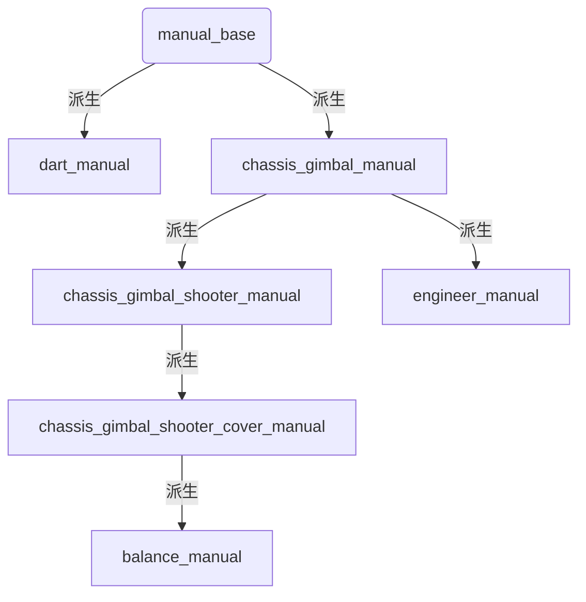

**before reading**

1. main.cpp中定义了这个节点的主函数，这个节点的运行实际是循环运行一个run函数，run函数是写在manual_base.h中的一个虚函数，子类中会重写这个函数
2. main函数中会根据robot type的不同，构造不同的类，然后调用不同的run，
   - 步兵：chassi_gimble_shooter_cover_manual
   - 英雄：chassis_gimble_shooter_manual
   - 工程：engineer_manual
   - 飞镖：dart_manual
   - 平衡：balance_manual
3. 此外manual中还有很多话题回调者

## 1. 代码结构

1. 类之间的关系




## 2. 代码详解

### 1. manual_base

1. manual_base中
   
   - 定义了run函数以及在里面层层嵌套的一些函数
   - 定义回调函数
   - 定义其它一些需要子类重写的虚函数
   
1. 主循环
   
   - 定义run()这个虚函数，在函数中调用  checkReferee()、 controller_manager_.update()两个接口
   
      ```c++
      void ManualBase::run()
      {
        checkReferee();
        controller_manager_.update();
      }
      ```
   
      - ```c++
         void ManualBase::checkReferee()
         {
         	//gimbal_power_on_event_、shooter_power_on_event_是两个event，通过gimbal_output_on_、shooter_output_on_这两个int（标志位的功能）来更新事件，而这两个int在ManualBase::gameRobotStatusCallback(const rm_msgs::GameRobotStatus::ConstPtr& data)这个回调中更新，这个回调是裁判系统数据的回调
             gimbal_power_on_event_.update(gimbal_output_on_);
             shooter_power_on_event_.update(shooter_output_on_);
             
             //通过两次事件戳的时间差来给 referee_is_online_这个标志位赋值，判断裁判系统是否离线
             //referee_last_get_stamp_在ManualBase::powerHeatDataCallback(const rm_msgs::PowerHeatData::ConstPtr& data)这个回调中赋值
             referee_is_online_ = (ros::Time::now() - referee_last_get_stamp_ < ros::Duration(0.3));
             
             //将manual_to_referee_pub_data_发布到 /manual_to_referee_这个话题
             manual_to_referee_pub_.publish(manual_to_referee_pub_data_);
         }
         ```
   
         - ```c++
           //上面提到的两个回调定义如下，基本都是存裁判系统的信息
           void ManualBase::gameRobotStatusCallback(const rm_msgs::GameRobotStatus::ConstPtr& data)
           {
             robot_id_ = data->robot_id;
             chassis_output_on_ = data->mains_power_chassis_output;
             gimbal_output_on_ = data->mains_power_gimbal_output;
             shooter_output_on_ = data->mains_power_shooter_output;
             robot_hp_event_.update(data->remain_hp != 0);
           }
           
           void ManualBase::powerHeatDataCallback(const rm_msgs::PowerHeatData::ConstPtr& data)
           {
             chassis_power_ = data->chassis_power;
             referee_last_get_stamp_ = data->stamp;
           }
           ```
   
      - controller_manager_.update()：
   
         ​	controller_manager是rm_common::ControllerManager这个类的实例，而update是在类中定义的成员函数，文件路径在这：
   
         <font color=red>rm_control/rm_common/include/rm_common/decision/controller_manager.h</font>
   
         
   
3. 回调部分

   - 在manual_base中定义了很多个话题订阅者，用来获取所需的信息，具体有如下：

     ```c++
       ros::Subscriber odom_sub_, dbus_sub_, track_sub_, referee_sub_, capacity_sub_, game_status_sub_, joint_state_sub_,
           game_robot_hp_sub_, actuator_state_sub_, power_heat_data_sub_, gimbal_des_error_sub_, game_robot_status_sub_,
           suggest_fire_sub_
     ```

     下面详解每一个回调函数（在manual_base中有定义的）

     ---

     

   - **dbusDataCallback**

     ```c++
     void ManualBase::dbusDataCallback(const rm_msgs::DbusData::ConstPtr& data)
     {
       if (ros::Time::now() - data->stamp < ros::Duration(1.0))	//如果当前时间与收到的data中的时间戳的时间差 < 1s，认为遥控开启
       {
         if (!remote_is_open_)	//如果remote_is_open_=false，，说明是首次开控，进入这个判断并执行其中的逻辑
         {
           ROS_INFO("Remote controller ON");
           remoteControlTurnOn();	//这个函数会将控制器start，并且manual进入空闲模式（一种开启了控制器但遥控控不了的模式）
           remote_is_open_ = true;
         }
           
         //更新右拨杆事件，拨杆（或者按键）的上升（下降）沿还有高（低）电平都绑定了一个函数，当触发对应的沿或电平就会调用对应的函数
         right_switch_down_event_.update(data->s_r == rm_msgs::DbusData::DOWN);
         right_switch_mid_event_.update(data->s_r == rm_msgs::DbusData::MID);
         right_switch_up_event_.update(data->s_r == rm_msgs::DbusData::UP);
     
         //state在右拨杆事件的那些函数中改变
         if (state_ == RC)
           updateRc(data);
         else if (state_ == PC)
           updatePc(data);
       }
       else	//else认为遥控关闭
       {
         if (remote_is_open_)
         {
           ROS_INFO("Remote controller OFF");
           remoteControlTurnOff();
           remote_is_open_ = false;
         }
       }
     
       sendCommand(data->stamp);
     }
     ```

     - ```c++
       void ManualBase::remoteControlTurnOn()
       {
         controller_manager_.startStateControllers();	//会运行StateControllers，具体在配置文件中写，其他一样
         controller_manager_.startMainControllers();
         state_ = IDLE;
       }
       ```

     - ```c++
       void ManualBase::updateRc(const rm_msgs::DbusData::ConstPtr& dbus_data)	//更新左拨杆
       {
         left_switch_down_event_.update(dbus_data->s_l == rm_msgs::DbusData::DOWN);
         left_switch_mid_event_.update(dbus_data->s_l == rm_msgs::DbusData::MID);
         left_switch_up_event_.update(dbus_data->s_l == rm_msgs::DbusData::UP);
       }
       ```

     - ```c++
       void ManualBase::updatePc(const rm_msgs::DbusData::ConstPtr& dbus_data)
       {
         checkKeyboard(dbus_data);	//manual_base中定义了这个虚函数，但没有内容，要在子类中根据需要来重写这个函数；按键的对应的enent的更新会放在这个函数中
       }
       ```

   - 剩下的回调基本都是将从话题收到的消息存在变量中，就不再写注释了


### 2. chassis_gimbal_manual

1. 重写基类中的函数

   - ```c++
     void ChassisGimbalManual::updateRc(const rm_msgs::DbusData::ConstPtr& dbus_data)
     {
       ManualBase::updateRc(dbus_data);
       gimbal_cmd_sender_->setRate(-dbus_data->ch_l_x, -dbus_data->ch_l_y);	//增加这一句，从dbus中获取摇杆的值作为参数调用gimbal_cmd_sender_中的接口，这个接口是用来设置rate模式下，云台的速度的，command_sender相关具体内容可以看command_sender的文档
     }
     ```

   - ```c++
     void ChassisGimbalManual::updatePc(const rm_msgs::DbusData::ConstPtr& dbus_data)
     {
       ManualBase::updatePc(dbus_data);
       gimbal_cmd_sender_->setRate(-dbus_data->m_x * gimbal_scale_, dbus_data->m_y * gimbal_scale_);	//将鼠标的x、y的值作为参数，调用接口
     }
     ```

   - ```c++
     void ChassisGimbalManual::checkKeyboard(const rm_msgs::DbusData::ConstPtr& dbus_data)
     {
       ManualBase::checkKeyboard(dbus_data);
       
       //更新wasd四个按键的event，对于工程按住wasd时不能按shift or ctrl，否则下面的表达式会得到false，不会认为按下了wasd
       if (robot_id_ == rm_msgs::GameRobotStatus::RED_ENGINEER || robot_id_ == rm_msgs::GameRobotStatus::BLUE_ENGINEER)
       {
         w_event_.update((!dbus_data->key_ctrl) && (!dbus_data->key_shift) && dbus_data->key_w);
         s_event_.update((!dbus_data->key_ctrl) && (!dbus_data->key_shift) && dbus_data->key_s);
         a_event_.update((!dbus_data->key_ctrl) && (!dbus_data->key_shift) && dbus_data->key_a);
         d_event_.update((!dbus_data->key_ctrl) && (!dbus_data->key_shift) && dbus_data->key_d);
       }
       else
       {
         w_event_.update(dbus_data->key_w);
         s_event_.update(dbus_data->key_s);
         a_event_.update(dbus_data->key_a);
         d_event_.update(dbus_data->key_d);
       }
       if (dbus_data->m_z != 0)	//如果鼠标中键值不为0，调用下面的函数
       {
         mouseMidRise(dbus_data->m_z);
       }
     }
     ```

     - ```c++
       void ChassisGimbalManual::mouseMidRise(double m_z)	//改变gimbal_scale的值，改变键鼠操作的灵敏度
       {
         if (gimbal_scale_ >= 1. && gimbal_scale_ <= 30.)
         {
           if (gimbal_scale_ + 1. <= 30. && m_z > 0.)
             gimbal_scale_ += 1.;
           else if (gimbal_scale_ - 1. >= 1. && m_z < 0.)
             gimbal_scale_ -= 1.;
         }
       }
       ```

2. 回调部分

   - 都是将消息传进command_sender中，不多解释

3. 沿/电平触发的函数

   - ```c++
     void ChassisGimbalManual::rightSwitchDownRise()	//右拨杆拨到下的上升沿触发函数
     {
       ManualBase::rightSwitchDownRise();
       chassis_cmd_sender_->setMode(rm_msgs::ChassisCmd::FOLLOW);	//调用chassis_cmd_sender_中的接口，会将底盘mode设置为follow
       vel_cmd_sender_->setZero();	//调用vel_cmd_sender_接口将速度指令设为0
       gimbal_cmd_sender_->setMode(rm_msgs::GimbalCmd::RATE);	//调用gimbal_cmd_sender_中的接口，会将云台mode设置为rate
       gimbal_cmd_sender_->setZero();	//将云台速度设为0
     }
     ```

   - 其他的拨杆事件触发的函数中定义的内容基本都是mode的设置、setZero这个接口的调用，不多解释

   - wasd按键事件触发的函数（w_pressing为例）

     ```c++
     void ChassisGimbalManual::wPressing()
     {
       double final_x_scale = x_scale_ * speed_change_scale_;
       vel_cmd_sender_->setLinearXVel(is_gyro_ ? final_x_scale * gyro_move_reduction_ : final_x_scale);	//调用这个接口，将linear_x的值设为传进去的这个参，其他asd的pressing or release都同理
     }
     ```

### 3. others

1. 其它派生出来的类就不做详解了，流程以及一些关系都是一样的，通过上面的内容理清manual的工作流程后剩下的就是一些事件函数内部的逻辑了，那些就不再写注释了

### 4. input_event

1. boost::function<>：

```c++
int main() 
{ 
  boost::function<int (const char*)> f = std::atoi; 
  std::cout << f("1609") << std::endl; 
  f = std::strlen; 
  std::cout << f("1609") << std::endl; 
} 

//这里定义了一个函数指针f，他可以指向所有符合这个签名的函数；在这个例子里也就是符合：返回int，传入参数为const char*的函数
```

2. boost::bind()：

```c++
void add(int i, int j) 
{ 
  std::cout << i + j << std::endl; 
} 

int main() 
{ 
  std::vector<int> v; 
  v.push_back(1); 
  v.push_back(3); 
  v.push_back(2); 

  std::for_each(v.begin(), v.end(), boost::bind(add, 10, _1));
}
    
  //std::for_each()要求第三个参数为一个一元函数（即只有一个参数），而add()为二元函数；这时我们就可以通过boost::bind
    
  //boost::bind()第一个参数为函数名；第二、三个参数是传给add的参数；boost::bind的第三个参数为占位符，有_1、_2、_3、...，有几个占位符，那么别人调用这个boost::bind时，得到的就是一个几元函数
    
  //v中的元素通过占位符传到bind，再传到add
    
  //改变占位符的位置，可以改变他们传到add中作为参数时的位置
```


## 2. 写键位method

### 1. 流程

1. 在头文件中定义Inputevent类型变量
2. 在构造函数中调用变量的setfalling、setrising之类的函数，这个决定了在什么情况下会调用这个键位的函数
   - setRising：上升沿触发，就是刚按下那一刻调用一次
   - setFalling：下降沿触发，就是刚松开时调用一次
   - setActiveHigh：高电平触发，就是在持续按住的过程中一直调用
   - setActiveLow：低电平触发，就是在持续松开时一直调用
3. checkKeyboard()：调用事件的update函数，也就是更新事件
4. 剩下的就是按键函数的逻辑