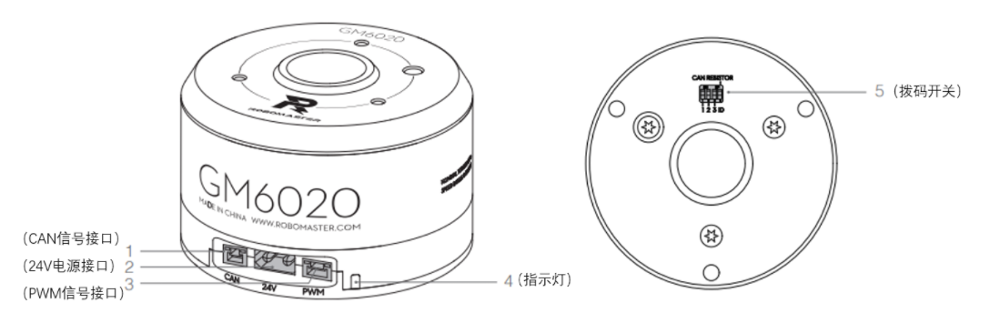
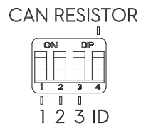
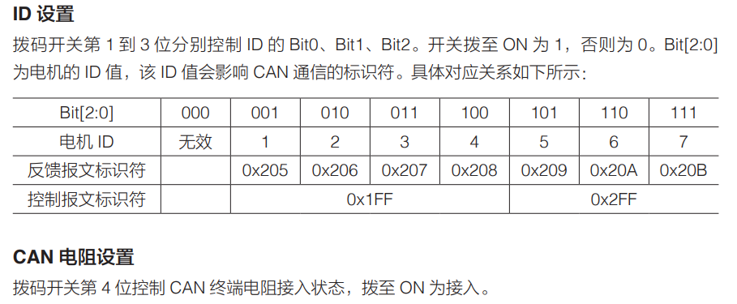
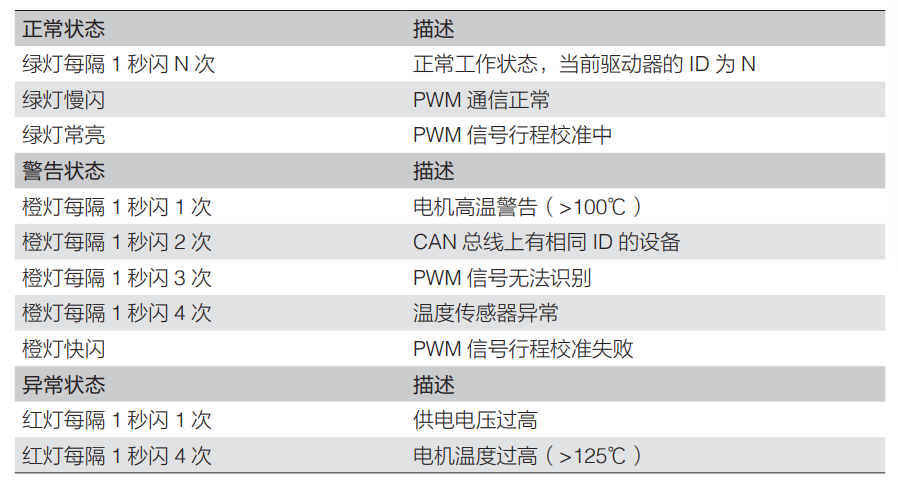
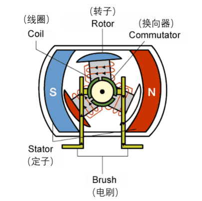
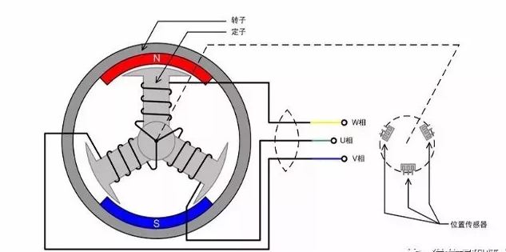
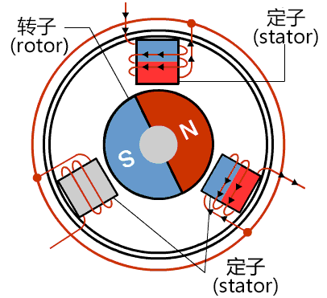

# GM6020云台电机

## 1. 特点

1. 直流无刷电机
2. 空心轴结构，可以安装滑环等配件
3. 具有过温、过压保护功能
4. 内部集成驱动器，形成电机和驱动器的一体化结构，结构紧凑、集成度高
5. 支持CAN、PWM的通讯方式
6. 通过can总线可以获取转子速度、转子位置、电机温度等信息
7. 可以通过拨码开关设置ID、选通CAN终端电阻

## 2. 结构、部分接口说明

### 接口1：CAN信号接口

1. 可以使用CAN信号线连接外部控制设备，接收CAN控制指令、反馈电机状态信息
2. CAN总线的比特率为1Mbps

### 接口3： PWM信号接口

1. 可以使用PWM信号线连接外部控制设备的PWM端口，控制电机转速或位置（模拟舵机模式）
2. 可以使用usb转串口连接pc，通过RoboMaster Assistant软件对电机进行固件升级、参数设置

### 接口5：拨码开关

1. 
2. 功能：设置电机的ID、选通CAN终端电阻
3. 使用方法：

## 3. 关于指示灯

1. 用于指示电机的工作状态、警告、异常信息
2. 警告、异常信息同时出现时，仅指示异常状态
3. 多个警告、异常信息同时出现，指示闪烁次数最少的警告or异常信息
4. 另外：异常状态下，驱动器将关闭
5. 指示灯情况&相关描述

## 4. 关于电机的使用

### 1. CAN控制模式：

1. 驱动器根据用户输入的目标值对转矩电压进行闭环控制。用户根据电机反馈的速度、位置等信息，在外部实现速度、位置闭环控制

### 2. PWM控制模式：

1. 电机支持速度、位置两种闭环控制模式，用户可以自由选择（直接控制）。

### 3. CAN信号和PWM信号一起输入，优先使用CAN信号控制。

## 5. 有刷电机

1. 

2. 工作原理：在电刷的两端之间通入电流，换向器就会自动改变转子的磁场方向，这样转子就会持续运动下去

## 6. 无刷电机

1. 结构1（转子在外，定子在内）

另一种结构（转子在内，定子在外）：

2. 工作原理：位置传感器实时检测转子的位置，根据转子的位置给电机的不同向通对应的电流，定子产生不断变化的磁场，使转子持续转动
3. 与有刷电机的区别：用位置传感器取代换向器和电刷