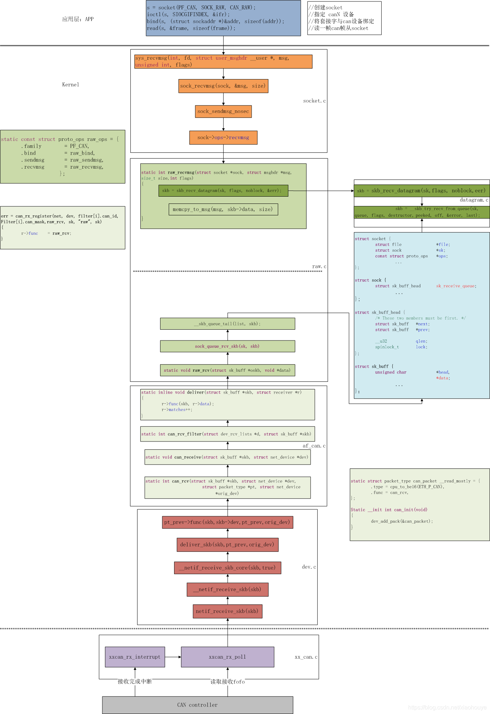

# Linux下的can编程

## 1. 什么是can编程

1. linux下使用can就是用socketcan，那么can编程就是用编程实现socketcan的数据传输
2. 从socketcan的数据传输流程入手，can编程就是编程实现socketcan数据传输的各个部分，比如发送数据的时候要先创建socket，指定can设备，那这个就要调用相应的函数实现，所以can编程就大概是写代码实现socketcan数据传输。

## 2. socketcan的编程（数据传输过程的某个步骤用什么函数？写什么代码？）

1. 发送过程

2. 接收过程

