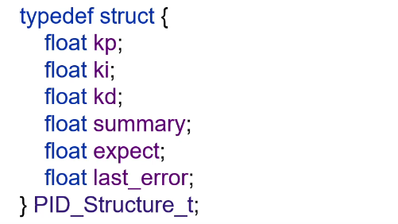

# PID控制器

## 1. 作用是什么？

pid控制器输入的是偏差，pid控制器就是使被控量被准确到达设定值的。

## 2. 其他控制方法——棒棒控制（启停式控制）

（用水桶举例）假设要往桶注50l水，一边在用水8L/s，一边在注水10L/s，到了50l停止，少了就又开

but 震荡很大

## 3. 总之就是。。。

1. p控制器（比例控制）：控制让曲线接近预设的值的速度。 最后稳定了会有一个静态误差，不能到预设值。

2. i控制器（积分项）：抹掉静态误差

3. d控制器（微分项）：使误差减小的速率变缓，就是让曲线震荡变小

## 4. PID衰减曲线法整定

1. 只调p，调成第一个波峰跟第二个波峰 衰减比为 4：1（或者10：1），然后用现在这个曲线的ti、td、。。。乘上经验系数，就可以得到所需的pid参数

## 5. PID自动整定法

### 1. 模式识别法（专家系统）

1. 就是系统它自己根据一个类似手册，根据确定的规则调整pid。

2. 根据暂态过程取特征向量，修正pid值

### 2. 模糊自适应整定PID

根据模糊的规则调整pid，跟模式识别法很像

### 3. 自校正PID（极点控制法）

1. 通过调整pid结构、参数，让特征多项式靠近预定的式子。
2. 这个pid表达式离原本的PID表达式很远。

3. 需要解丢番图。

### 4. 神经网路PID

基于bp反向传播神经网络的自学习pid控制器。。。需要调整的一般是平滑因子、神经网络的学习率等

### 5. 其他参数优化算法

#### 1. PID，simplex寻优（单纯形法）

从可行域找一个顶点，看他能否让目标函数最优，不行就往下找下一个顶点。

#### 2. PID,fminsearch寻优

无梯度优化算法，根据目标函数样本拟合，对拟合的函数寻优 or 用一些启发式的算法。

#### 3. PID，ga寻优

模拟自然界遗传的规律，设计一个遗传因子，放到种群繁衍，定期给它一个自然选择，最后剩下的就是最优解。

### 6. 另外

1. 模糊自适应整定PID、神经网络PID都是对非线性时不变系统比较有效，对特定优化指标比如ise无能为力。

## 6. PI过冲、抗积分饱和

开始的时侯，曲线会快速到达预设值，这个过程积分项会累加一个很大的值（因为积分项是累加误差值的），那这个时候曲线就会超过预设值，就是PI过冲了。使用抗积分饱和算法解决。

### 抗积分饱和算法

判断积分项是否超过限制范围，超过了就不再累加。避免积分项累积的值太大，很难退出饱和区

## 7. 不完全微分PID控制（加入低通滤波器）

1. 微分项可能会引入高频干扰，加入低通滤波器可以减少被干扰的风险（因为低通滤波器可以滤除高频干扰，有用的低频信号则可以无衰减的通过）

2. 低通滤波器可以加在微分调节的输出端 / PID相加之后的输出端。

   

3. 通常用一阶低通滤波器，也可以用其他低通滤波器

##  8. 微分先行PID

1. 定义：在输出端进行微分，而不在输入端微分

   

2. 如果用户设定的值在不断变化的话，就会引入高频干扰，这个时候可以通过微分先行PID防止超调过大。
3. 由公式可得，微分先行pid的微分部分跟设定值没有关系，只与测量值有关，所以在这里阶跃变化不会造成干扰。

## 9. C编写PID函数

1. PID结构体

   

2. PID计算函数

   

