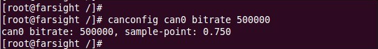
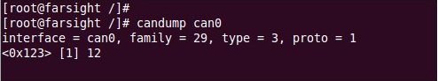
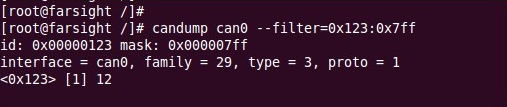

# can-utils（其中的SocketCan用户空间应用）

## 1. 什么是can-utils

1. can-utils是socketcan的测试工具集
2. can-utils是基于GNU GPLv2许可的开源代码，用于检测和监控SocketCAN接口
3. can-utils包括canconfig、canecho、cansend、candump、cansequence五个工具 ????

## 2. can-utils里用于display, record, generate and replay CAN traffic的基本工具）

1. candump : display, filter and log CAN data to files（显示、筛选、记录can数据到文件）
2. canplayer : replay CAN logfiles（重播can日志文件）
3. cansend : send a single frame（发送一个单个的帧）
4. cangen : generate (random) CAN traffic（随机产生can traffic）
5. cansequence : send and check sequence of CAN frames with incrementing payload（发送和检查有效载荷递增的can帧的序列）
6. cansniffer : display CAN data content differences（显示can数据内容的差异）

## 3. 通过IP套接字进行can访问的工具

1. canlogserver : log CAN frames from a remote/local host（记录来自一个远程/本地主机的can帧）
2. bcmserver : interactive BCM configuration (remote/local)（交互式BCM配置（远程/本地））
3. [socketcand](https://github.com/linux-can/socketcand) : use RAW/BCM/ISO-TP sockets via TCP/IP sockets（通过 TCP/IP 套接字使用 RAW/BCM/ISO-TP 套接字）
4. [cannelloni](https://github.com/mguentner/cannelloni) : UDP/SCTP based SocketCAN tunnel（基于 UDP/SCTP 的 SocketCAN通道）

## 4. 用于内核网关配置的工具

1. cangw : CAN gateway userspace tool for netlink configuration（用于netlink配置的、can网关用户空间的工具）

## 5. can总线测量和测试的工具

1. canbusload : calculate and display the CAN busload（计算并显示can总线载荷）
2. can-calc-bit-timing : userspace version of in-kernel bitrate calculation（内核比特率计算的用户空间版本）
3. canfdtest : Full-duplex test program (DUT and host part)

## 6. can-utils怎么用

### 1. 以下是几个常用的指令

1. 配置CAN的总线通讯波特率： canconfig canX bitrate + 波特率

2. 开启 / 重启 / 关闭CAN总线
       canconfig canX start
       canconfig canX restart
       canconfig canX stop

3. 查看CAN总线状态：canecho canX

4. can设备发送信息：cansend canX –-identifier=ID + 数据

5. can设备接收数据：candump canX

6. 使用滤波器接收ID匹配的数据：candump canX –-filter=ID:mask

<mark>其实直接在apt装就行，缺依赖就从apt装</mark>

### 2. 关于使用can-utils时

1. 使用can-utils要下载can-utils的源码（因为can-utils是开源代码）
2. 因为canutils编译需要libsocketcan库的支持，需要下载libsocketcan库

### 3. 使用can-utils前的工作

1. 下载canutils的源码

2. 下载libsocketcan

3. 解压libsocketcan-0.0.9.tar.bz2，通过执行configure命令： 

   ./configure --host=arm-none-linux-gnueabi --prefix=/home/linux/workdir/can/tools/libsocketcan

   （其中--host是指定交叉工具链，--prefix是指定库的生成位置）

4. catkin build编译这个库

5. 执行make install 生成库。至此，libsocketcan编译完毕

6. 解压canutils-4.0.6.tar.bz2，通过执行configure命令：

    ./configure --host=arm-none-linux-gnueabi --prefix=/home/chen/cantool/canutils-4.0.6/out libsocketcan_LIBS=-lsocketcan LDFLAGS=-L/home/chen/cantool/libsocketcan-0.0.11/out/lib CPPFLAGS=-I/home/chen/cantool/libsocketcan-0.0.11/out/include

   （其中--host是指定交叉工具链，--prefix是指定库的生成位置，libsocketcan_LIBS是指定canconfig需要链接的库，LDFLAGS是指定外部库的路径，CPPFLAGS是指定外部头文件的路径）

7. 编译，编译后生成四个目录，分别拷贝到开发板文件系统的相应目录

8. 现在就可以使用can-utils了