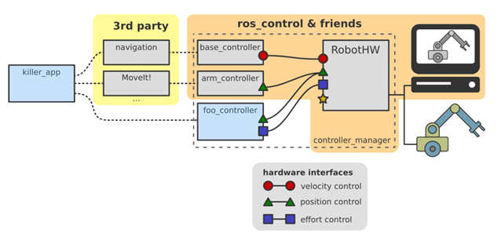
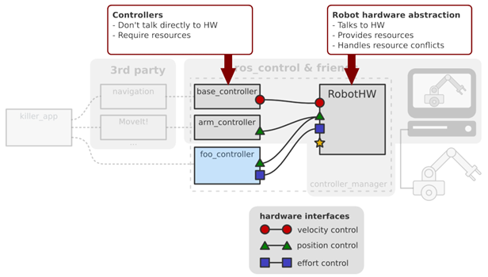
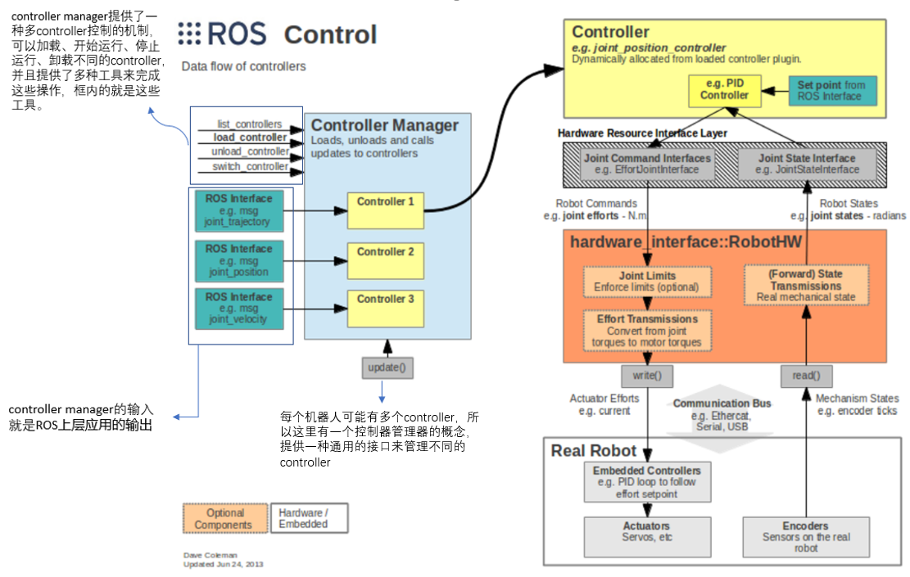
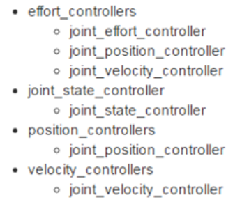

# 1.ros control

## 1. 是什么

1. ros中有很多应用，比如SLAM、Movelt这些，要把这些应用用到实际的机器人或者是仿真的机器人中，需要一个中间人，这个中间人就是ros control，ros control包含一系列控制器接口、传动装置接口、硬件接口、控制器工具箱等等。
2. ros control的总体框架



## 2. 特点

1. controller不直接联系硬件，它通过向硬件抽象层请求资源，然后硬件抽象层直接联系硬件层，向controller提供资源（所以硬件抽象层负责硬件资源管理）



## 3. 数据传输流程

1. 

2. （1）执行器（Actuator）的编码器等传感器数据被读取后，通过 Transmissions Interface 映射成关节 (Joint) 等机器人状态

   （2）将状态通过状态接口传递给controller

   （3）经过控制器计算后得到关节指令经过限制，再映射为电机的指令

   （4）发送给电机

# 2. controllers

1. ros_controllers功能包提供了已有的一些controller



2. 可以根据需要自己创建controller，通过controller manager管理controller
3. controller以动态库的形式被编译

# 3. controller manager

1. 控制controller的命令行的格式

```
$ rosrun controller_manager controller_manager <command> <controller_name>
```

支持的<command>：

- load: load a controller (construct and initialize)
- unload: unload a controller (destruct)
- start: start a controller
- stop: stop a controller
- spawn: load and start a controller
- kill: stop and unload a controller

2. 查看controller状态的命令行格式

```
$ rosrun controller_manager controller_manager <command>
```

支持的<command>:

- **list**: list all the controllers in the order they are executed, and give the state of each controller
- **list-types**: list all the controller types the controller manager knows about. If your controller is not in this list, you won't be able to spawn it.
- **reload-libraries**: Reloads all the controller libraries that are available as plugins. This is convenient when you are developing a controller and you want to test your new controller code, without restarting the robot every time. This does not restart controllers which were running before.
- **reload-libraries --restore**: Reloads all the controller libraries that are available as plugins and restores all controllers to their original state.

3. 很多时候我们需要控制的controller有很多，比如六轴机器人，至少有六个controller，这时也可以使用“spawner ”这个命令来一次控制多个controller：

```
rosrun controller_manager spawner [--stopped] name1 name2 name3
```

加上--stopped参数，那么contrller只会被加载；反之，controller自动加载并启动

4. 停止controller但不卸载可以用以下命令

```
 $ rosrun controller_manager unspawner name1 name2 name3
```

# 4. Transmission

1. Transmission是机器人的传动装置，每一个需要运动的关节都需要配置相应传动装置。可以通过代码完成配置，但是大多数情况都是在URDF文件中直接添加
2. 为了让gazeb能够识别<transmission>标签，还需要在URDF文件中加载一个插件”gazebo_ros_control“

# 5. Joint limits

1. Joint limits是硬件抽象层中的一块，是维护一个关节限位的数据结构；包含关节速度、位置、加速度、加加速度、力矩等方面的限位，同时还包含安全作用的位置软限位、[速度边界（k_v）](http://wiki.ros.org/pr2_controller_manager/safety_limits)和[位置边界（k_p）](http://wiki.ros.org/pr2_controller_manager/safety_limits)等等。
2. 这些限位数据可以从机器人的URDF文件中加载，也可以ROS的参数服务器上加载（先用YAML配置文件导入ROS parameter server）


# 6. ros control的使用（以控制一个具有两个关节的机械臂为例）

## 1. 在其URDF文件中添加两个关节对应的两个transmission

```
<transmission name="tran1">
    <type>transmission_interface/SimpleTransmission</type>
    <joint name="joint1">
      <hardwareInterface>EffortJointInterface</hardwareInterface>
    </joint>
    <actuator name="motor1">
      <hardwareInterface>EffortJointInterface</hardwareInterface>
      <mechanicalReduction>1</mechanicalReduction>
    </actuator>
  </transmission>

  <transmission name="tran2">
    <type>transmission_interface/SimpleTransmission</type>
    <joint name="joint2">
      <hardwareInterface>EffortJointInterface</hardwareInterface>
    </joint>
    <actuator name="motor2">
      <hardwareInterface>EffortJointInterface</hardwareInterface>
      <mechanicalReduction>1</mechanicalReduction>
    </actuator>

  </transmission>
```

## 2. 在URDF文件中添加”gazebo_ros_control“插件

```
<gazebo>
  <plugin name="gazebo_ros_control" filename="libgazebo_ros_control.so">
    <robotNamespace>/rrbot</robotNamespace>
  </plugin>
</gazebo>
```

## 3. 写YAML文件

1. 声明所需的controller，以及对应的参数
2. 其中还需要包含一个joint_state_controller，来控制发布每个关节的实时状态

```
rrbot:
  # Publish all joint states -----------------------------------
  joint_state_controller:
    type: joint_state_controller/JointStateController
    publish_rate: 50 

  # Position Controllers ---------------------------------------
  joint1_position_controller:
    type: effort_controllers/JointPositionController
    joint: joint1
    pid: {p: 100.0, i: 0.01, d: 10.0}
  joint2_position_controller:
    type: effort_controllers/JointPositionController
    joint: joint2

    pid: {p: 100.0, i: 0.01, d: 10.0}
```

## 4. 编写launch文件

1. 运行controller_manager中的spawner，加载并运行所需的controller

```
<launch>

  <!-- Load joint controller configurations from YAML file to parameter server -->
  <rosparam file="$(find rrbot_control)/config/rrbot_control.yaml" command="load"/>

  <!-- load the controllers -->
  <node name="controller_spawner" pkg="controller_manager" type="spawner" respawn="false"
    output="screen" ns="/rrbot" args="joint1_position_controller joint2_position_controller joint_state_controller"/>

  <!-- convert joint states to TF transforms for rviz, etc -->
  <node name="robot_state_publisher" pkg="robot_state_publisher" type="robot_state_publisher"
    respawn="false" output="screen">
    <remap from="/joint_states" to="/rrbot/joint_states" />
  </node>

</launch>
```

## 5. 运行launch文件