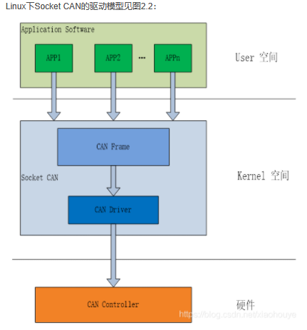
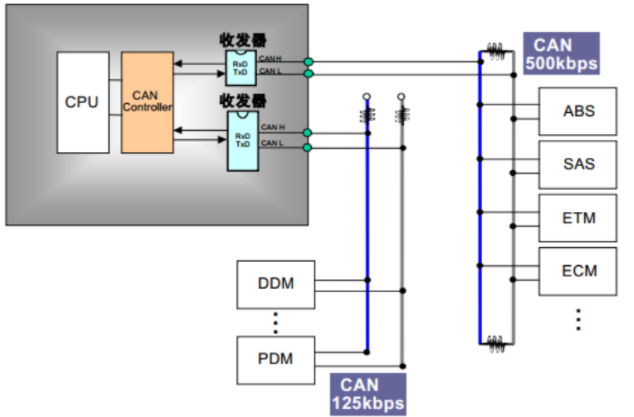
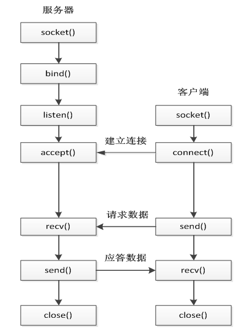
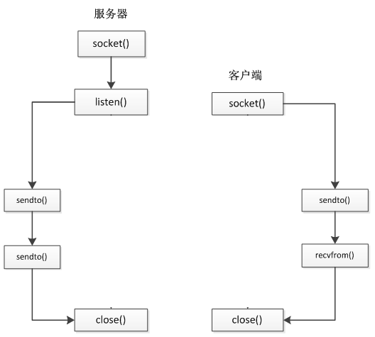

# SocketCan

## 1. 关于SocketCan

1. （根据GitHub上的说法是）Linux CAN subsystem (aka SocketCAN) ：Linux-CAN子系统。
2. socketcan子系统是Linux下can总线协议实现的一种方法。（就是使用can总线的一种方法）
3. socketcan是can总线驱动的一种实现方式。（can总线驱动关联很多个can设备驱动，就大概是设备驱动组成了总线驱动）
4. socketcan是一种特定架构can设备驱动。它让can设备驱动可以作为网络接口被调用。

5. can设备应该是can控制器

6. can总线的发送/接收节点里面有can控制器和can收发器。can控制器是用来将报文转换为can帧或者can帧转换为报文的，can收发器是将控制器发过来的can帧从二进制码流转换成差分信号，发送到can总线或者从总线接收差分信号，转换成二进制码流。

7. socketcan这种方法使用socket接口、Linux网络协议栈，使can设备驱动可以作为网络接口来调用。
8. CAN控制器的设备驱动将自己作为一个网络设备注册进Linux的网络层，就是说socketcan把自己变成了一个网络设备，然后他就可以进到Linux网络层，用网络接口调用驱动。

## 2. socket

### 1. 定义：

  socket翻译是”插座“，计算机里叫“套接字”。socket是作为通信端口，也是指计算机通讯的一种方式。socket可以用于不同主机的通讯，也可以用在同一主机不同进程的通讯。socket采用client/server模型，就是客户端——服务器模型。

### 2. socket的类型

#### 	1. 字节流套接字（SOCK_STREAM）(面向连接的数据传输方式)

   1. 数据按什么顺序发送就按什么顺序被接收，例如：发送a-b-c，接收也是a-b-c，保证数据传输准确、可靠。如果数据损坏或者丢失，他会重新发送，所以准确性高但效率比较慢。

   2. （1）SOCE_STREAM采用TCP协议。

      （2）TCP协议是一种面向连接的、可靠的、 基于IP的传输层协议。也就是说他的传输方式是面向连接的。（采用tcp协议==采用面向连接的传输方式）

   3. （1）TCP协议中，tcp通过三次握手来进行连接，socket采用的也是类似tcp的三次握手来连接客户端跟服务器端。

      （2）socket的三次握手：

      1.  第一次握手：客户端调用调用connect函数，触发连接请求，向服务器发送SYN J包，connect进入阻塞状态
      2. 第二次握手：服务器listen函数监听到连接请求（即接收到SYN J包），调用accept函数接受请求，向客户端发送SYN K , ACK J+1, accept函数进入阻塞状态。客户端接收到SYN K, ACK J+1后，connect函数返回，并对SYN K进行确认。
      3. 第三次握手：客户端向服务器端发送一个确认ACK K+1，服务器接收到ACK K+1，accept函数返回 

      

#### 	2. 数据报套接字（SOCK_DGRAM）(无连接的数据传输方式)

​		1. 计算机不做数据的校验，如果传输的时候数据损坏或这丢失，不会重新发送，就是数据坏就坏了，不管，继续传。所以这种方式效率高（因为不用校验、重发），但是准确性低

​		2. 用无连接的传输方式：就是发送数据时不用建立类似TCP那样的握手连接。就是没有中间连接的那部分 ，只需要把数据打包，加上一个远程ip地址就可以。

#### 	3. 原始套接字（SOCK_RAW）

​	socketcan采用的就是原始套接字。该接口允许对较底层协议进行操作，如IP、ICMP等。原始套接字常用于检验新的协议实现或访问现有服务中配置的新设备。

#### 	4. 总结面向连接&无连接

1. 面向连接传输就好比有两栋房子，a栋跟b栋之间建了一条传送带，用这条传送带把包裹运过去。
2. 无连接传输就是在a栋楼下的菜鸟把包裹寄出去，怎么送，走哪条路是快递的事，快递会把包裹送到b栋。
