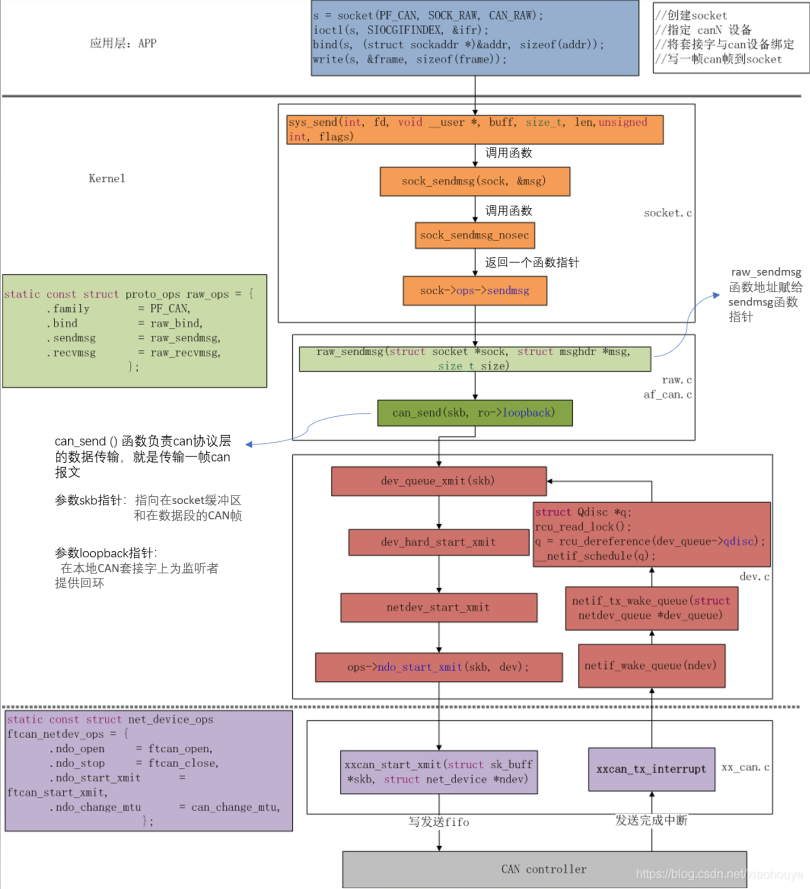
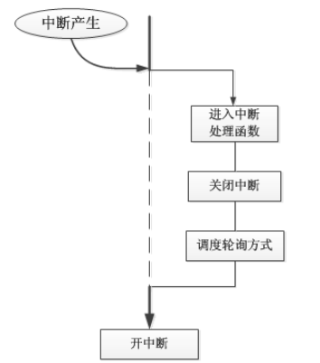
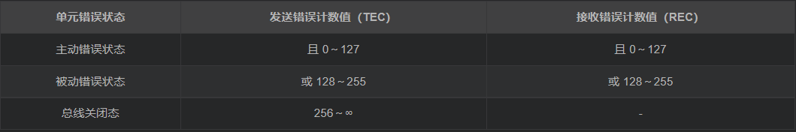
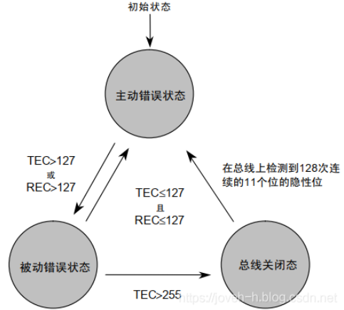

# SocketCan数据传输（发生在用户层—硬件层）

## 1. 发送流程

### 1. socket初始化

1. 创建一个用户层跟内核层之间的socket，使用socket()函数。
2. 使用ioctl函数指定一个can设备。
3. socket与can设备绑定，使用bine()函数。

### 2. 发送数据

1. 发送一帧can帧到socket，作用是在CAN协议调用之前把socket移动到内核空间、检查用户空间数据域是否可读。
2. 在socket上使用read()/write()，也可以使用send()/sendto()/sendmsg()和对应的recv*操作来传输数据。
3. 在内核空间通过各种函数、驱动这些东西把数据传给can控制器
4. 通信时采用can_frame结构体将数据封装成帧。

## 2. 接收流程

1. 中断产生时，中断处理函数d_can_isr() 通过napi_schedule()函数，调用d_can_poll()函数，这个函数采用轮询的方式开始进行数据的接收。
2. 初始化can设备，初始化时要给can设备分配NAPI功能，就是通过netif_napi_add()函数将CAN设备添加到NAPI机制列表中，就是注册轮询函数d_can_poll()。

3. 由于CAN总线状态中断具有最高优先权，在接收数据之前，需要对CAN总线的状态进行判断。

4. socketcan数据接收流程采用中断+NAPI机制进行接收

5. 当中断产生后，会调度轮询机制，同时关闭所有的中断

## 3. NAPI机制

1. NAPI机制时Linux 上采用的一种提高网络处理效率的技术。
2. NAPI机制不采用中断的方式读取数据，而是以首先采用中断唤醒数据接收的服务程序，然后 用POLL 的方法来轮询数据。

## 4. can总线的状态（3种错误状态）

### 1. 三种状态

1. 主动错误状态：可以正常参加总线通信的状态

2. 被动错误状态：

   （1）被动错误状态是易引起错误的状态

   （2）处于被动错误状态的单元虽能参加总线通信，但为不妨碍其它单元通信，接收时不能积极地发送错误通知

   （3）处于被动错误状态的单元即使检测出错误，而其它处于主动错误状态的单元如果没发现错误，整个总线也被认为是没有错误的

   （4）处于被动错误状态的单元检测出错误时，输出被动错误标志

   （5）另外，处于被动错误状态的单元在发送结束后不能马上再次开始发送，在开始下次发送前，在间隔帧期间内必须插入“延迟传送”(8 个位的隐性位)

3. 总线关闭状态：不能参加总线通信的状态

### 2. 三种状态的转换

这些状态依靠发送**错误计数**和**接收错误计数**来管理，根据计数值决定进入何种状态

### 2. 三种状态的关系

### 

