# 底盘轮系的速度计算（全向轮）

## 1. 全向轮

### 1.自身坐标系下的逆运动学模型（已知底盘速度，求轮子速度）

1. 假设：世界坐标系：X‘ Y’ O‘；自身坐标系：X O Y；底盘速度分解为沿x轴正方向的速度Vx，沿y轴正方向的速度为Vy，转动角速度w；底盘中心距端点L；各个轮子速度为Va，Vb，Vc 。（如图）

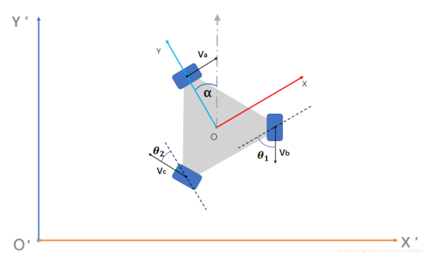

2. 由矢量关系可以得到每个轮子的速度方程（关于底盘速度的）（如下）

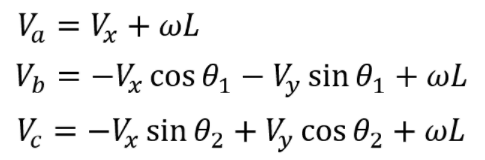

写成矩阵的形式：

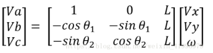

### 2. 世界坐标系下的模型

1. 上面的矩阵*旋转矩阵就是了
2. 从X′O′Y′到XOY的旋转矩阵为：

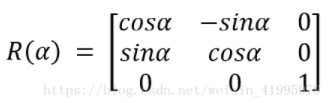

​	所以从XOY到X′O′Y′的旋转矩阵就是R(α)的逆矩阵：

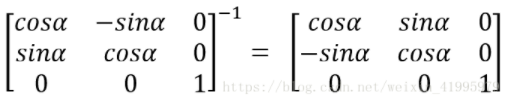

3. 由上面的旋转矩阵可以得到底盘速度在两个坐标系之间的关系矩阵（如下）：

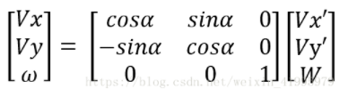

4. 将这个关系矩阵带入到1中求出的矩阵，然后化简得到：

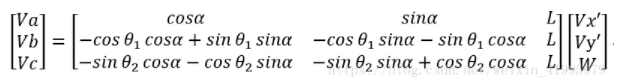

### 3. 旋转矩阵（求法）

1. 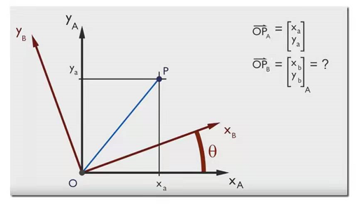

2. 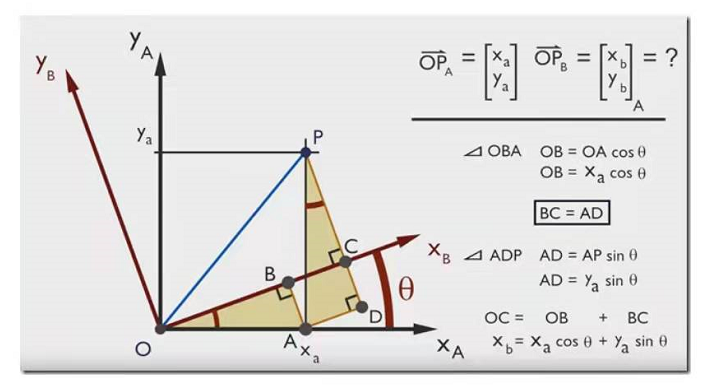
3. 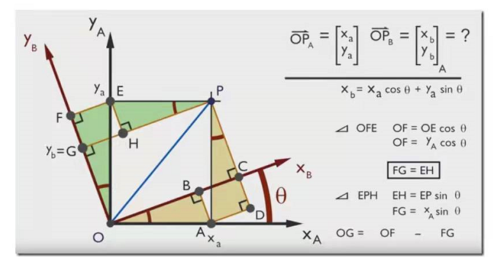

4. 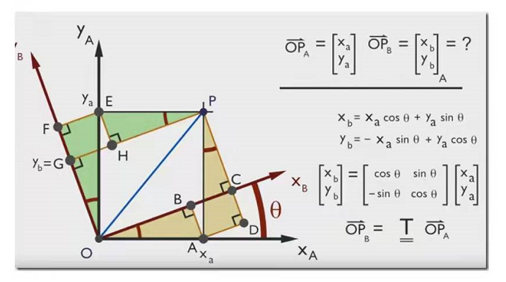

