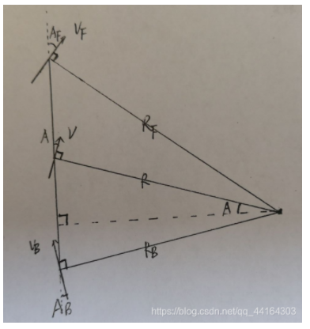
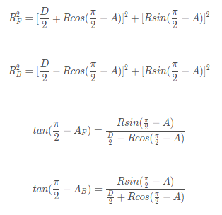
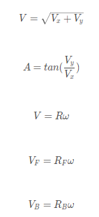
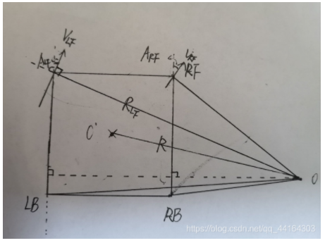
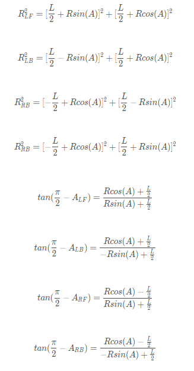
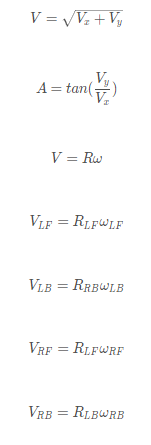

# 底盘轮系的速度计算（舵轮）

## 1. 双舵轮（已知底盘的速度、旋转角速度，求舵轮旋转角度和速度）

1. 假设前轮的速度为Vf，与当前车身姿态形成的夹角为Af ；后轮为Vb、Ab；

   前后轮的距离为D；

   目标圆心与两轮连线中点形成夹角（即目标圆心与底盘速度的夹角）为A；

   车体几何中心与目标圆心连线所形成的半径为R；

   

2. **几何关系**（如下）

3. **物理关系**（如下）

4. 结合物理关系与几何关系可以得到Vf、Vb、Af、Ab

## 2. 四舵轮（...）

1. 假设：

   左前轮速度、与车体夹角、与目标圆心连线长度：Vlf、Alf、Rlf

   左后轮：Vlb、Alb、Rlb

   右前轮：Vrf、Arf、Arf

   右后轮：Vrb、Arb、Rrb

   车身为正方形、边长为L

   车体几何中心与目标圆心的连线长度R

   

2. **几何关系**

3. **物理关系**

4. 结合几何、物理关系可得每个舵轮所需的速度、角度（如下）

