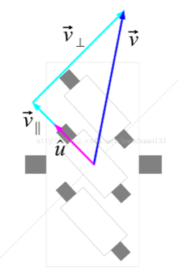

# 底盘轮系的速度计算（麦克纳姆轮）

## 1. 麦克纳姆轮

### 1. 使用逆运动学计算（方法1）

1. 将底盘的运动分解为三个独立变量来描述；

​	x轴方向的速度Vx，y轴方向的速度Vy，yaw轴方向的速度w（旋转角速度）。（Vt是底盘的速度）

2. 根据第一步的结果，计算出每个轮子轴心的速度（把轮子当成质点时它的速度）；

​	将每个轮子轴心的速度分解，一个是Vr，一个是Vt，四个轮子的Vr抵消，剩下Vt那个分量就是底盘表现出来的速度；

​	所以也可以逆过来看，根据整个底盘表现出来的已知的速度Vt，得到每个轮子上Vt这个速度分量，再根据正交分解得到轮子轴心的速度矢量图

3. 根据第二步的结果，计算出每个轮子与地面接触的辊子的速度；

​	可以将轮子轴心的速度分解成分解成沿辊子方向、垂直辊子方向（紫线表示向量是单位向量）。垂直辊子方向的速度可以忽略（因为转化成了辊子自身的转速），所以辊子的速度就是沿辊子方向的速度分量 。

4. 根据第三步的结果，计算出轮子的真实转速。

   辊子跟轮子呈45°角，利用三角函数求轮子真实转速

5. 合并整理以上式子，得到由底盘速度求每个轮子转速的式子：（a是r的水平分量，b是竖直分量）

### 2.使用逆运动学计算（方法2）

1. 原理：底盘是一个全线性系统，而刚体运动又可以线性分解为3个分量，所以可以通过计算出底盘在（1）沿x轴运动时（2）沿y轴运动时（3）绕几何中心自转时 的轮子的速度；通过加法可得到由这3种运动合成的  旋转+平移  时，所需的轮子转速。