# 机器人比赛中常用的底盘轮系

## 1. 麦克纳姆轮

1. 结构：轮毂、辊子、减震圈（辊子跟轮毂呈45°角）

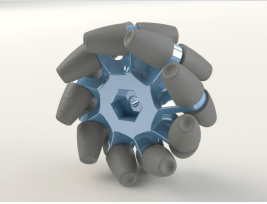

2. 作用：使机器人实现全向移动
3. 全向转动的实现方法：一个轮子由一个电机控制，四个轮子不同转向（向前or向后），使每个轮子所受摩擦力方向改变，车受到的力，就是摩擦力的合力改变方向，从而使运动方向改变

举例：（这里的轮子都是俯视的，而摩擦力是根据接触地面的轮子平面分析的）

（1）向前运动：四个轮子左右方向的力抵消，只剩向前的力

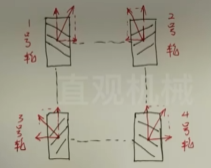

（2）向右运动：前后方向的力抵消，只剩向右的力

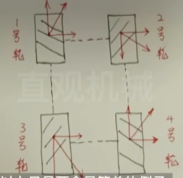

4. 麦轮的摩擦力分析：

（1）假设轮子向前运动，此时辊子受到两种摩擦，垂直辊子方向的滚动摩擦，平行辊子方向的滑动摩擦；辊子受到的滑动摩擦力很大，而滚动摩擦可以忽略，所以就可以看成这个辊子受到的摩擦力就是这个平行辊子方向上的摩擦力。

​		（f方向：把辊子的速度分解成垂直辊子方向&平行辊子方向，由于受到的摩擦力跟速度方向相反，所以有两个方向上的摩擦力）

​		（f种类：因为垂直辊子的方向上，辊子是滚动的，所以受到的是滚动摩擦；平行辊子的方向上，受到的是滑动摩擦，因为辊子滑动）

（2）每个麦轮在转动时，受到的摩擦力方向其实就是辊子受到的摩擦力方向，所以麦轮受到的摩擦力是跟辊子呈45°角（因为辊子跟轮毂方向呈45°角）

## 2. 全向轮

1. 结构：轮毂、从动轮；轮毂的外圆周处均匀开设3个或3个以上的轮毂齿，每两个轮毂齿之间装设有一从动轮，从动轮的径向（半径方向）与轮毂外圆周的切线方向垂直；有内圈跟外圈两层

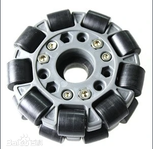

2. 作用：同样是全向移动
3. 两种典型布置方式：

（1）三角形布置

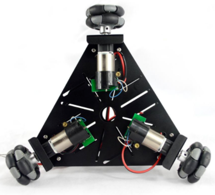

（2）十字形布置

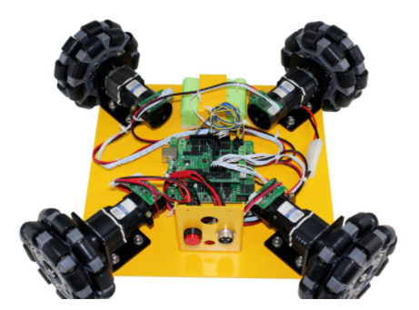

​	(3) 两种方式的对比：三轮结构中，不可能使所有轮胎运行方向均与运动方向一致，系统效率不可能达到100%；四轮驱动结构中，相对的两个轮胎可以100%效率运行，同时另外两个轮胎保持，因而，此时理论效率可以达到100%，就是十字形比三角形效率高

## 3. 麦轮&全向轮

1. 共同点：都是能向各个方向移动；辊子间都有间隙，都会导致震动；
2. 区别：麦克纳姆轮的滚子之间存在的间隙大，使得轮子在转动过程中同地面接触点的高度不断变化，导致车体振动更剧烈；全向轮通过两层辊子，填补间隙使其趋近圆形，间隙小因此震动比较小。

## 4. 舵轮（是一种轮组机构）

1. 结构：

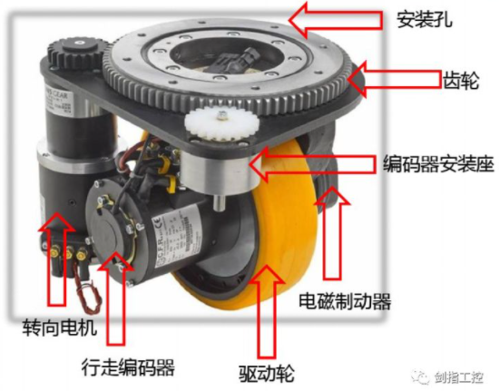

2. 根据电机的安装位置可以将舵轮分为两种：卧式和立式

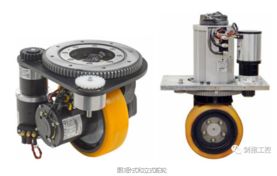

3. 每个舵轮由两个电机控制，一个用来驱动、一个用来转向
4. 舵轮的转动比麦轮那些更快、更灵活

### 1. 舵轮的驱动方式

1. 四舵轮：四个车轮既是驱动轮又是转向轮，每个车轮都有两个电机单独控制，一个电机控制小车驱动，一个电机控制小车转向，可以实现小车的纵向、横向、回转等方向的行驶。这种方式转向灵活。

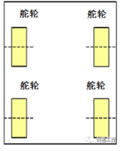

2. 双舵轮：通过调整两个舵轮的角度及速度，可以使小车在不转动车头的情况下实现变道，转向等动作：甚至可以实现沿任意点为半径的转弯运动，有很强的灵活性。但是对电机和控制精度要求较高。

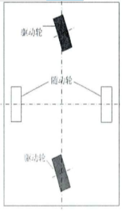

### 2. 舵轮与万向轮的综合应用

（1）优点：横向推动方便

（2）缺点：用舵机充当避震器，起到减震的作用，对舵机的损耗较大，要时常更换舵机，并且更换舵机过程复杂、安装时间长。

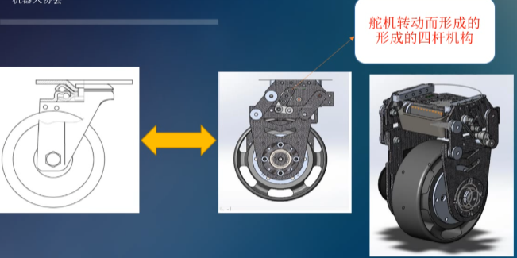