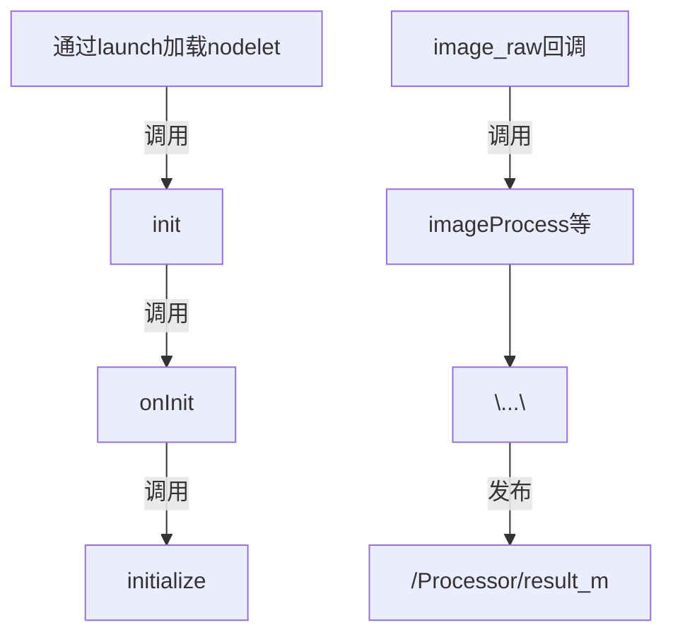

## 运行流程

## Nodelet

1. nodelet的启动：launch文件中将nodelet加载到manager，manager会调用nodelet的init函数，init函数会调用onInit函数，onInit函数是一个虚函数，需要在子类中重写
2. nodelet的运行：onInit函数中会开启一个线程，在线程中一直运行
3. 编写的nodelet需要写成插件，以插件的形式被manager动态加载

## ros相关

1. ros::SingleThreadedSpinner：单线程Spinner，可以在一个线程中，通过它的成员函数spin循环callback queue

   

## cv

1. cv::dnn::Net：这个类用于创建、操作人工神经网络

2. cv::dnn::readNetFromONNX()：这个接口用于加载onnx模型来创建网络，参数为onnx模型

3. cv::Mat：n维密集数组 类，用来表示n维密集单(多)通道数组，可以存储灰度、彩色图像等

4. cv::getStructuringElement(int shape, Size ksize, Point anchor = Point(-1,-1))：

   - 用于创建一个特定大小、形状的结构元
   - shape：指定形状，可选以下3种
     - 矩形：MORPH_RECT
     - 交叉形：MORPH_CROSS
     - 椭圆形：MORPH_ELLIPSE
   - ksize：结构元大小
   - anchor：锚点的位置，默认在结构元中心

5. cv::split(InputArray m, OutputArrayOfArrays mv)：对图像m进行多通道的分离、并将分离出的图像放到mv中

6. cv::threshold( InputArray src, OutputArray dst, double thresh, double maxval, int type )

   - 用来进行二值化

   - src：输入的图像

   - dst：输出的图像

   - thresh：输出图像中像素颜色的最大值

   - type：阈值的类型

     

7. 